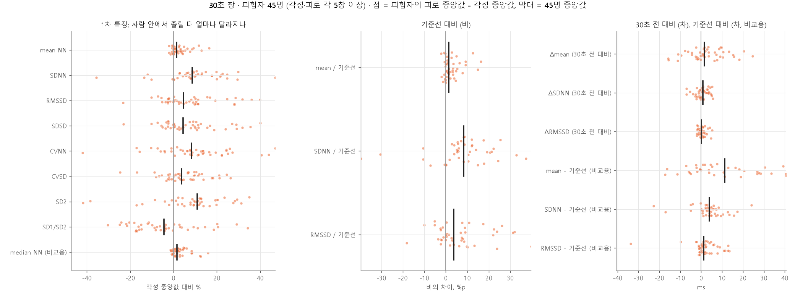

# 특징 표 결과

특징 표 설계대로 만든 30초·60초 표를 모델에 넣기 전에 확인한 결과다. 표는 MPD-DF 50명의 RR(학습 검출기)을 5초 블록 누산 모델에 흘려 만들고, 한 행은 피험자 한 명의 30초 에폭 하나다.

## 1. 집계

| 창 | 행 | 라벨 있음 | 칩 판정 (커버리지) | 유효(학습·채점) | 각성 : 피로 | 무효 사유 |
|---|---|---|---|---|---|---|
| 30초 | 12,531 | 12,264 | 12,170 (97.1%) | 11,903 | 9,085 : 2,818 (3.22:1) | baseline 300, artifact 267, low_n 61 |
| 60초 | 12,531 | 12,264 | 12,167 (97.1%) | 11,900 | 9,083 : 2,817 (3.22:1) | artifact 267, baseline 250, low_n 64, no_window 50 |

- 행 = 50명 × 에폭. 칩 판정 = 첫 3분 보류와 박동 부족을 뺀 것, 라벨과 무관. 유효 = 칩 판정 중 라벨이 있는 것.
- 커버리지 손실 2.9% 중 2.4%가 첫 3분 워밍업, 0.5%가 박동 부족. 박동 부족 61창 중 대부분 26번.
- 기준선을 못 만든 사람(`base_ok = 0`) 없음. SD2 절단(2·SDNN² − RMSSD²/2 < 0) 30초 10행, 60초 1행.
- 클래스 비율 3.22:1. 모델 비교에서 가중치 또는 임계값으로 대응한다.

## 2. 계산 검증

유효 행의 특징별 분포를 각성과 피로로 나눠 그렸다.

값의 범위가 생리학적으로 맞다. mean NN 700~1300 ms(46~86 bpm), SDNN 10~120 ms, RMSSD 10~100 ms, SD1/SD2 대체로 0.2~1.0. 음수 없음. 02번 첫 창: mean 783 ms, SDNN 30 ms, RMSSD 23 ms로 안정 상태 성인 값.

전체를 섞은 분포는 각성과 피로가 거의 겹친다. 예상대로 사람 간 차이가 상태 차이보다 크다. 기준선 대비 열(`mean / 기준선`, `SDNN / 기준선`)은 원래 열보다 두 분포가 눈에 띄게 갈린다. 개인 기준선이 사람 간 차이를 지우는 효과가 그림에서 보인다.

## 3. 방향 재현: 사람 안 짝 비교

피험자마다 (피로 창 중앙값 − 각성 창 중앙값)을 구해 점 하나로 찍었다. 각성·피로 창이 각 5개 이상인 45명. Wilcoxon 부호순위 검정.

30초 창:

| 특징 | 중앙값 변화 | 증가한 사람 | Wilcoxon p |
|---|---|---|---|
| mean NN | +1.4% | 32/45 | 1.5e-05 |
| SDNN | +8.7% | 39/45 | 2.4e-05 |
| RMSSD | +4.6% | 31/45 | 0.0024 |
| SDSD | +4.4% | 31/45 | 0.0024 |
| CVNN | +8.4% | 34/45 | 0.00062 |
| CVSD | +3.7% | 31/45 | 0.011 |
| SD2 | +11.0% | 37/45 | 2.8e-05 |
| SD1/SD2 | −4.4% | 15/45 | 0.061 |
| median NN (비교용) | +1.6% | 32/45 | 1.2e-05 |
| mean / 기준선 | +0.013 | 32/45 | 1.7e-05 |
| SDNN / 기준선 | +0.083 | 39/45 | 1.3e-05 |
| RMSSD / 기준선 | +0.037 | 31/45 | 0.0016 |
| Δmean (30초 전 대비) | +1.56 ms | 27/45 | 0.084 |
| ΔSDNN (30초 전 대비) | +0.76 ms | 26/45 | 0.14 |
| ΔRMSSD (30초 전 대비) | +0.07 ms | 25/45 | 0.5 |
| mean − 기준선 (비교용) | +11.2 ms | 32/45 | 1.4e-05 |
| SDNN − 기준선 (비교용) | +3.9 ms | 39/45 | 2.4e-05 |
| RMSSD − 기준선 (비교용) | +1.2 ms | 31/45 | 0.0024 |

60초 창은 같은 방향이고 크기가 조금 작다(mean NN +0.9%, SDNN +8.1%, SD2 +8.0%, RMSSD +3.1%). 직전 창 대비 셋은 60초에서도 유의하지 않다(ΔRMSSD만 p 0.015).

읽기:

- **문헌의 방향이 재현됐다.** 운전 피로 문헌고찰(Lu 2022)에서 유일하게 일치한 "졸리면 심박이 느려진다"가 mean NN +1.4%(32/45, p 1.5e-5)로 나왔다. 흔들림도 커졌다. SDNN +8.7%(39/45), SD2 +11%, RMSSD +4.6%. 같은 문헌의 시뮬레이터 가설(졸음 진행 → 부교감 우세 → HR 감소·변동 증가)과 맞고, 수면부족 없이 단조 운전을 한 MPD-DF에서 예상한 방향 그대로다.
- **효과가 작다.** mean NN +1.4%는 850 ms 기준 12 ms, 심박수로 1 bpm이다. 30초 창 하나의 흔들림보다 훨씬 작다. 사람 안에서 방향은 일관되지만 창 하나로 가르기는 어렵다는 뜻이다. 가장 큰 효과는 SD2·SDNN(느린 흔들림)이다.
- **SD1/SD2는 내려간다**(유의하지 않음). 빠른 흔들림(RMSSD +4.6%)보다 느린 흔들림(SD2 +11%)이 더 커져서다. 다른 특징과 다른 정보를 담을 가능성이 있어 후보에 남긴다.
- **직전 창 대비 셋은 효과가 없다.** Vicente 2016의 상위 특징에 직전 1분 대비 계열이 없었던 것과 같은 결과다.
- **기준선 대비의 비와 차는 짝 비교에서 같은 결과**다(사람 안 비교는 이미 개인차를 지운 상태라 당연). 둘의 차이는 전체 풀에서 모델을 학습할 때 드러난다.
- 45명 중 13~15명은 반대 방향이다. 개인차이거나, 졸음에 저항하는 교감 방향(Lu 2022)이거나, 라벨 문제일 수 있다.

## 4. 상관

유효 행 Pearson r. |r| ≥ 0.95 쌍:

| 쌍 | 30초 | 60초 | 뜻 |
|---|---|---|---|
| RMSSD – SDSD | 1.000 | 1.000 | 같은 값. d의 평균이 0이라 |
| mean NN – median NN | 0.997 | 0.997 | 가짜 봉우리 영향이 작다. mean으로 충분 |
| SDNN – SD2 | 0.990 | 0.993 | SD2는 SDNN과 거의 같다 |
| CVNN – SD2 | 0.964 | 0.957 | |
| SDNN – CVNN | 0.954 | | |

1차 8개 중 독립적인 것은 넷 정도다: mean NN, SDNN(≈ SD2 ≈ CVNN), RMSSD(= SDSD ≈ CVSD), SD1/SD2. 표에서는 표시만 하고 빼지 않았다. 정리는 모델 비교의 학습 폴드 안에서 한다.

## 5. 정답 봉우리로 만든 표와 비교

neurokit 정답 봉우리에 같은 SQI·누산·특징을 적용해 정답 표를 만들고, 둘 다 유효한 행에서 |학습 검출기 표 − 정답 표| / 정답 표를 봤다.

30초 창, 11,568행:

| 특징 | 중앙값 | 95 분위 |
|---|---|---|
| mean NN | 0.01% | 1.8% |
| SDNN | 0.60% | 50.2% |
| RMSSD | 1.94% | 65.3% |
| SD2 | 0.45% | 46.1% |
| SD1/SD2 | 1.79% | 39.9% |

창의 유효 박동 수가 정답과 같은 행 79.1%(60초 69.5%).

읽기: 대부분의 창에서 봉우리 오차는 특징에 거의 안 번진다(중앙값 0.01~2%). 그러나 5%의 창에서는 RMSSD가 절반 이상 다르다. 봉우리 하나가 빠지거나 끼면 그 자리의 d가 커져 RMSSD·SDSD에 크게 들어가기 때문이다. SDNN·mean은 둔하다. 이 꼬리는 정답 자체가 깨진 사람(20·21·24·42번 대체 방법, 26·33·38번 가짜 봉우리)이 섞여 있어 **상한**이다. 정답 표는 학습 검출기 표보다 박동 부족 창이 7배 많아(447 대 61) 정답이 더 나쁜 구간도 있다.

## 6. 모델 비교에 넘기는 것

- 30초·60초 표. 학습·채점은 `valid == 1`. 행 키 (sid, epoch)가 같아 창 길이 비교는 같은 정답으로 한다.
- 특징 후보 14개 열: `mean_nn sdnn rmssd sdsd cvnn cvsd sd2 sd12 mean_rb sdnn_rb rmssd_rb mean_dp sdnn_dp rmssd_dp`. 비교용 `median_nn`, `*_db`.
- 사전 정보: 0.95 이상 쌍(4절), 직전 창 대비는 효과 없음(3절), 클래스 3.22:1, 커버리지 97.1%.
- 성적 기대치: 사람 안 효과가 mean NN 1.4%, SDNN 9% 수준이라 창 단위 분류는 어렵다. 사건 단위 민감도(사건 안에 한 번이라도 경보)를 창 민감도와 함께 주 지표로 두는 이유다.

모델 비교 결과, 사람을 분리한 교차검증에서 새 사람에게 통한 특징은 `mean_rb`(창 평균 RR ÷ 기준선 평균 RR) 하나였고 창은 60초로 정했다.
