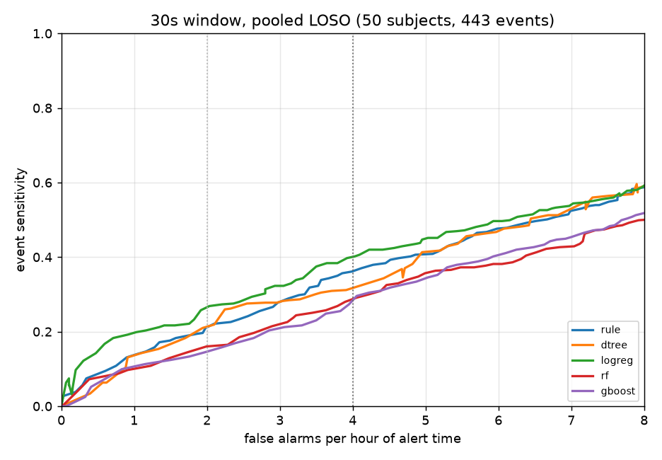
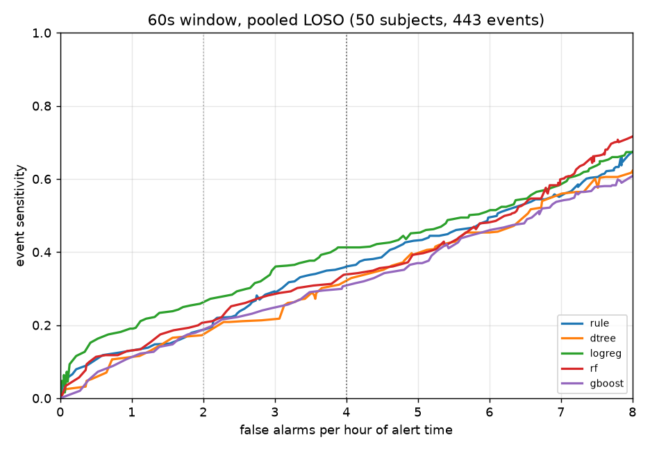

# 모델 비교 결과

비교한 모델·창 조합 10개: 규칙(특징1+문턱) 30초, 규칙(특징1+문턱) 60초, 얕은 트리 30초, 얕은 트리 60초, 로지스틱 30초, 로지스틱 60초, 랜덤포레스트 30초, 랜덤포레스트 60초, 부스팅 트리 30초, 부스팅 트리 60초. '최고세트'는 1-SE 규칙 대신 안쪽 AUC가 가장 높은 특징 세트를 쓴 변형이다.

## 읽는 법

- 평가는 피험자 50명을 한 명씩 빼는 교차검증(LOSO)이고, 모든 선택(손잡이·특징·문턱)은 학습 49명 안에서만 한다.
- 주 지표는 사건 단위 민감도다. 졸음 사건 443건 중 사건 구간 안에 경보가 한 번이라도 켜진 비율.
- 짝 지표는 각성 시간당 헛경보 횟수다. 민감도는 문턱을 내리면 얼마든지 오르므로 반드시 짝으로 읽는다.
- 모든 표는 헛경보가 정확히 그 값이 되는 문턱을 이분법으로 찾아 계산한다. 곡선 보간값과 섞으면 표끼리 어긋난다.
- 모델 비교는 같은 헛경보에서 한다. 모델마다 헛경보 예산을 쓰는 정도가 달라 상한별 표로 비교하면 왜곡된다.
- 정확도는 싣지 않는다. 경보를 한 번도 안 켜면 76.3%가 나오는 데이터라 뜻이 없다.
- **최종 선택**: 모델 로지스틱 특징 1개(`mean_rb`), 창 60초, 주 동작점 헛경보 4회/h(칩에 넣는 문턱), 참고 동작점 2회/h.

## 1. 한눈에 보기 (같은 헛경보에서의 사건 민감도)

| 모델 | 칩 | 헛경보 1회/h | 헛경보 2회/h | 헛경보 4회/h | 전원 AUC | 특징 | 파라미터 | 곱셈 |
|---|---|---|---|---|---|---|---|---|
| 규칙(특징1+문턱) 30초 | ○ | 0.135 | 0.212 | 0.361 | 0.558 | 1 | 2 B | 0 |
| 규칙(특징1+문턱) 60초 | ○ | 0.127 | 0.188 | 0.361 | 0.581 | 1 | 2 B | 0 |
| 얕은 트리 30초 | ○ | 0.135 | 0.212 | 0.312 | 0.547 | 2 | 137 B | 0 |
| 얕은 트리 30초 (최고세트) | ○ | 0.104 | 0.183 | 0.327 | 0.576 | 4 | 149 B | 0 |
| 얕은 트리 60초 | ○ | 0.111 | 0.181 | 0.313 | 0.548 | 2 | 69 B | 0 |
| 얕은 트리 60초 (최고세트) | ○ | 0.175 | 0.227 | 0.336 | 0.573 | 3 | 69 B | 0 |
| 로지스틱 30초 | ○ | 0.199 | 0.262 | 0.402 | 0.597 | 1 | 2 B | 1 |
| 로지스틱 30초 (최고세트) | ○ | 0.169 | 0.246 | 0.404 | 0.599 | 2 | 3 B | 2 |
| 로지스틱 60초 | ○ | 0.190 | 0.265 | 0.413 | 0.599 | 1 | 2 B | 1 |
| 로지스틱 60초 (최고세트) | ○ | 0.147 | 0.218 | 0.406 | 0.587 | 2 | 3 B | 2 |
| 랜덤포레스트 30초 | ○ | 0.102 | 0.156 | 0.282 | 0.535 | 3 | 44,926 B | 0 |
| 랜덤포레스트 60초 | ○ | 0.132 | 0.206 | 0.340 | 0.568 | 3 | 44,168 B | 0 |
| 부스팅 트리 30초 | ○ | 0.108 | 0.144 | 0.284 | 0.539 | 3 | 10,862 B | 0 |
| 부스팅 트리 60초 | ○ | 0.107 | 0.188 | 0.306 | 0.537 | 3 | 6,975 B | 0 |

'전원 AUC'는 모두에게 같은 문턱 하나를 쓸 때의 판별력이다. 칩이 하는 일이 그것이라 사람별 평균 AUC보다 이 값이 맞다.

## 2. FROC 곡선

**30초 창**

**60초 창**

## 3. 주 동작점: 헛경보 4회/시간 (15분에 한 번)

| 모델 | 사건 민감도 | 창 민감도 | 잡은 사건 안 커버율 | 깊은 사건(피로2+) | 실제 헛경보/h | 경보 적중률 |
|---|---|---|---|---|---|---|
| 규칙(특징1+문턱) 30초 | 0.361 | 0.233 | 0.67 | 0.578 | 3.99 | 0.39 |
| 규칙(특징1+문턱) 60초 | 0.361 | 0.349 | 0.90 | 0.622 | 3.99 | 0.42 |
| 얕은 트리 30초 | 0.312 | 0.190 | 0.50 | 0.556 | 3.99 | 0.37 |
| 얕은 트리 30초 (최고세트) | 0.327 | 0.214 | 0.50 | 0.511 | 3.90 | 0.40 |
| 얕은 트리 60초 | 0.313 | 0.211 | 0.74 | 0.511 | 3.98 | 0.35 |
| 얕은 트리 60초 (최고세트) | 0.336 | 0.233 | 0.64 | 0.544 | 3.94 | 0.40 |
| 로지스틱 30초 | 0.402 | 0.314 | 0.73 | 0.667 | 3.99 | 0.44 |
| 로지스틱 30초 (최고세트) | 0.404 | 0.260 | 0.56 | 0.622 | 3.99 | 0.44 |
| 로지스틱 60초 | 0.413 | 0.368 | 1.00 | 0.633 | 3.99 | 0.44 |
| 로지스틱 60초 (최고세트) | 0.406 | 0.307 | 0.76 | 0.600 | 3.99 | 0.43 |
| 랜덤포레스트 30초 | 0.282 | 0.139 | 0.44 | 0.489 | 3.99 | 0.35 |
| 랜덤포레스트 60초 | 0.340 | 0.202 | 0.63 | 0.544 | 3.99 | 0.37 |
| 부스팅 트리 30초 | 0.284 | 0.127 | 0.40 | 0.567 | 3.96 | 0.34 |
| 부스팅 트리 60초 | 0.306 | 0.165 | 0.50 | 0.478 | 3.99 | 0.35 |

놓침 방지를 우선한다는 원칙에 따라 주 동작점으로 정했다. 4회/h 문턱은 폴드 간에 안정적이고(규칙 모델 원값 기준 중앙값 +9.8%, 사분위 +9.4~+10.3%), 2회/h는 문턱이 튀는 폴드가 있다. 법정 비교(EU 2021/1341: KSS 8 이상 경보, 평균 민감도 40% 초과, 90% 신뢰구간 하한 20% 초과)는 '깊은 사건' 칸으로 한다. 우리 라벨에서 KSS 8에 대응하는 것은 피로2 이상이며, 이 대응은 등가 증명이 아니라 정성적 정합성 논증이다. 경보 적중률은 이 동작점에서 0.44로 인간공학 권고선 0.5를 밑돈다. 다만 그 적중률은 MPD-DF의 높은 사건 빈도(시간당 4.5건) 덕에 나온 값이고 실차(0.044건)에서는 어느 동작점이든 훨씬 낮아지므로 동작점을 가르는 기준으로는 약하다.

## 3b. 참고 동작점: 헛경보 2회/시간 (30분에 한 번)

| 모델 | 사건 민감도 | 창 민감도 | 잡은 사건 안 커버율 | 깊은 사건(피로2+) | 실제 헛경보/h | 경보 적중률 |
|---|---|---|---|---|---|---|
| 규칙(특징1+문턱) 30초 | 0.212 | 0.141 | 0.61 | 0.400 | 1.99 | 0.44 |
| 규칙(특징1+문턱) 60초 | 0.188 | 0.151 | 0.86 | 0.356 | 1.99 | 0.42 |
| 얕은 트리 30초 | 0.212 | 0.114 | 0.40 | 0.433 | 1.99 | 0.45 |
| 얕은 트리 30초 (최고세트) | 0.183 | 0.113 | 0.50 | 0.333 | 1.97 | 0.42 |
| 얕은 트리 60초 | 0.181 | 0.101 | 0.43 | 0.367 | 1.98 | 0.38 |
| 얕은 트리 60초 (최고세트) | 0.227 | 0.138 | 0.59 | 0.378 | 1.97 | 0.44 |
| 로지스틱 30초 | 0.262 | 0.198 | 0.82 | 0.478 | 1.98 | 0.51 |
| 로지스틱 30초 (최고세트) | 0.246 | 0.161 | 0.57 | 0.389 | 1.99 | 0.47 |
| 로지스틱 60초 | 0.265 | 0.225 | 1.00 | 0.456 | 1.99 | 0.50 |
| 로지스틱 60초 (최고세트) | 0.218 | 0.158 | 0.82 | 0.356 | 1.99 | 0.44 |
| 랜덤포레스트 30초 | 0.156 | 0.071 | 0.33 | 0.378 | 1.99 | 0.38 |
| 랜덤포레스트 60초 | 0.206 | 0.133 | 0.58 | 0.367 | 1.99 | 0.44 |
| 부스팅 트리 30초 | 0.144 | 0.066 | 0.33 | 0.322 | 1.99 | 0.35 |
| 부스팅 트리 60초 | 0.188 | 0.100 | 0.44 | 0.344 | 1.99 | 0.41 |

깊은 사건 민감도 40%와 적중률 0.5 권고를 함께 넘는 보수적 동작점이다(4회/h는 적중률 0.44). 참고로 남긴다.

**사건 단위는 관대한 채점이다.** 사건 안에 경보가 한 번이라도 겹치면 검출로 센다(NEDC any-overlap). 졸음은 발작과 달리 연속 상태이고 우리 사건은 30초 해상도로 자르며 생긴 덩어리이므로, 이 관대함을 숨기지 않으려고 창 민감도(졸음 칸 중 경보가 켜진 비율)와 잡은 사건 안 커버율을 같은 표에 싣는다. 긴 사건일수록 커버율이 낮아진다. 30초 창에서 3분 초과 사건은 잡았다고 세어도 절반 가까이 조용했고, 60초 창에서는 커버율 1.00이다.

## 4. 상한별 결과 (칩에 이 절차를 그대로 넣었을 때)

| 모델 | 상한 1회/h | 상한 2회/h | 상한 4회/h |
|---|---|---|---|
| 규칙(특징1+문턱) 30초 | 0.009 [0.00-0.02], 실제 0.11 | 0.090 [0.03-0.18], 실제 0.78 | 0.255 [0.15-0.37], 실제 2.85 |
| 규칙(특징1+문턱) 60초 | 0.041 [0.01-0.09], 실제 0.18 | 0.118 [0.04-0.22], 실제 0.91 | 0.302 [0.19-0.43], 실제 3.54 |
| 얕은 트리 30초 | 0.077 [0.02-0.17], 실제 0.81 | 0.183 [0.09-0.30], 실제 1.72 | 0.269 [0.16-0.39], 실제 3.22 |
| 얕은 트리 30초 (최고세트) | 0.099 [0.04-0.19], 실제 1.04 | 0.176 [0.09-0.28], 실제 1.86 | 0.248 [0.16-0.35], 실제 3.20 |
| 얕은 트리 60초 | 0.107 [0.04-0.21], 실제 0.98 | 0.159 [0.07-0.27], 실제 1.51 | 0.322 [0.22-0.44], 실제 4.02 |
| 얕은 트리 60초 (최고세트) | 0.166 [0.08-0.28], 실제 1.12 | 0.200 [0.10-0.33], 실제 1.48 | 0.324 [0.21-0.45], 실제 4.14 |
| 로지스틱 30초 | 0.194 [0.09-0.32], 실제 0.90 | 0.226 [0.11-0.35], 실제 1.84 | 0.368 [0.24-0.50], 실제 3.70 |
| 로지스틱 30초 (최고세트) | 0.176 [0.08-0.31], 실제 1.12 | 0.255 [0.14-0.39], 실제 2.31 | 0.406 [0.29-0.53], 실제 4.27 |
| 로지스틱 60초 | 0.188 [0.07-0.32], 실제 0.98 | 0.247 [0.13-0.37], 실제 1.78 | 0.401 [0.28-0.53], 실제 3.71 |
| 로지스틱 60초 (최고세트) | 0.150 [0.05-0.28], 실제 1.14 | 0.243 [0.13-0.38], 실제 2.44 | 0.435 [0.32-0.57], 실제 4.15 |
| 랜덤포레스트 30초 | 0.097 [0.05-0.15], 실제 1.16 | 0.163 [0.09-0.25], 실제 2.15 | 0.291 [0.20-0.40], 실제 4.25 |
| 랜덤포레스트 60초 | 0.120 [0.04-0.23], 실제 0.81 | 0.179 [0.09-0.29], 실제 1.51 | 0.306 [0.20-0.43], 실제 3.53 |
| 부스팅 트리 30초 | 0.095 [0.04-0.17], 실제 0.99 | 0.181 [0.10-0.27], 실제 2.13 | 0.300 [0.21-0.41], 실제 4.52 |
| 부스팅 트리 60초 | 0.068 [0.02-0.13], 실제 0.77 | 0.159 [0.08-0.26], 실제 1.61 | 0.252 [0.16-0.36], 실제 3.49 |

괄호는 피험자 단위 부트스트랩 95% 신뢰구간. '실제'는 시험 피험자에서 실제로 나온 헛경보다. 상한과 실제가 벌어지는 정도가 모델마다 달라 이 표로 모델을 비교하면 안 된다.

## 5. 창 길이 30초 대 60초

| 모델 | 목표 헛경보 | 창 | 사건 민감도 | 창 민감도 | 잡은 사건 안 커버율 | 깊은 사건 |
|---|---|---|---|---|---|---|
| 규칙(특징1+문턱) | 1회/h | 30초 | 0.135 | 0.068 | 0.50 | 0.267 |
|  | 1회/h | 60초 | 0.127 | 0.101 | 0.88 | 0.256 |
| 규칙(특징1+문턱) | 2회/h | 30초 | 0.212 | 0.141 | 0.61 | 0.400 |
|  | 2회/h | 60초 | 0.188 | 0.151 | 0.86 | 0.356 |
| 규칙(특징1+문턱) | 4회/h | 30초 | 0.361 | 0.233 | 0.67 | 0.578 |
|  | 4회/h | 60초 | 0.361 | 0.349 | 0.90 | 0.622 |
| 얕은 트리 | 1회/h | 30초 | 0.135 | 0.070 | 0.33 | 0.300 |
|  | 1회/h | 60초 | 0.111 | 0.072 | 0.50 | 0.267 |
| 얕은 트리 | 2회/h | 30초 | 0.212 | 0.114 | 0.40 | 0.433 |
|  | 2회/h | 60초 | 0.181 | 0.101 | 0.43 | 0.367 |
| 얕은 트리 | 4회/h | 30초 | 0.312 | 0.190 | 0.50 | 0.556 |
|  | 4회/h | 60초 | 0.313 | 0.211 | 0.74 | 0.511 |
| 로지스틱 | 1회/h | 30초 | 0.199 | 0.134 | 0.79 | 0.356 |
|  | 1회/h | 60초 | 0.190 | 0.143 | 1.00 | 0.311 |
| 로지스틱 | 2회/h | 30초 | 0.262 | 0.198 | 0.82 | 0.478 |
|  | 2회/h | 60초 | 0.265 | 0.225 | 1.00 | 0.456 |
| 로지스틱 | 4회/h | 30초 | 0.402 | 0.314 | 0.73 | 0.667 |
|  | 4회/h | 60초 | 0.413 | 0.368 | 1.00 | 0.633 |
| 랜덤포레스트 | 1회/h | 30초 | 0.102 | 0.045 | 0.31 | 0.256 |
|  | 1회/h | 60초 | 0.132 | 0.093 | 0.67 | 0.278 |
| 랜덤포레스트 | 2회/h | 30초 | 0.156 | 0.071 | 0.33 | 0.378 |
|  | 2회/h | 60초 | 0.206 | 0.133 | 0.58 | 0.367 |
| 랜덤포레스트 | 4회/h | 30초 | 0.282 | 0.139 | 0.44 | 0.489 |
|  | 4회/h | 60초 | 0.340 | 0.202 | 0.63 | 0.544 |
| 부스팅 트리 | 1회/h | 30초 | 0.108 | 0.045 | 0.31 | 0.256 |
|  | 1회/h | 60초 | 0.107 | 0.049 | 0.33 | 0.256 |
| 부스팅 트리 | 2회/h | 30초 | 0.144 | 0.066 | 0.33 | 0.322 |
|  | 2회/h | 60초 | 0.188 | 0.100 | 0.44 | 0.344 |
| 부스팅 트리 | 4회/h | 30초 | 0.284 | 0.127 | 0.40 | 0.567 |
|  | 4회/h | 60초 | 0.306 | 0.165 | 0.50 | 0.478 |

## 6. 크기 사다리 (특징·손잡이는 고정, 크기만 변경)

| 모델 | 크기 | 헛경보 2회/h 민감도 | 전원 AUC | 파라미터 |
|---|---|---|---|---|
| 얕은 트리 30초 | {"max_depth": 1} | 0.255 | 0.536 | 5 B |
| 얕은 트리 30초 | {"max_depth": 2} | 0.209 | 0.531 | 13 B |
| 얕은 트리 30초 | {"max_depth": 3} | 0.212 | 0.534 | 29 B |
| 얕은 트리 30초 | {"max_depth": 4} | 0.196 | 0.566 | 53 B |
| 얕은 트리 30초 | **제약 없음(탐색 최고)** | 0.213 | 0.547 | 137 B |
| 얕은 트리 60초 | {"max_depth": 1} | 0.151 | 0.591 | 5 B |
| 얕은 트리 60초 | {"max_depth": 2} | 0.236 | 0.497 | 13 B |
| 얕은 트리 60초 | {"max_depth": 3} | 0.221 | 0.519 | 29 B |
| 얕은 트리 60초 | {"max_depth": 4} | 0.199 | 0.528 | 53 B |
| 얕은 트리 60초 | **제약 없음(탐색 최고)** | 0.175 | 0.548 | 69 B |
| 랜덤포레스트 30초 | {"n_estimators": 4, "max_depth": 3} | 0.212 | 0.524 | 108 B |
| 랜덤포레스트 30초 | {"n_estimators": 8, "max_depth": 3} | 0.211 | 0.531 | 220 B |
| 랜덤포레스트 30초 | {"n_estimators": 8, "max_depth": 4} | 0.215 | 0.533 | 408 B |
| 랜덤포레스트 30초 | {"n_estimators": 16, "max_depth": 4} | 0.191 | 0.538 | 824 B |
| 랜덤포레스트 30초 | {"n_estimators": 32, "max_depth": 4} | 0.192 | 0.536 | 1,620 B |
| 랜덤포레스트 30초 | {"n_estimators": 64, "max_depth": 6} | 0.174 | 0.540 | 7,752 B |
| 랜덤포레스트 30초 | **제약 없음(탐색 최고)** | 0.160 | 0.535 | 44,926 B |
| 랜덤포레스트 60초 | {"n_estimators": 4, "max_depth": 3} | 0.203 | 0.525 | 112 B |
| 랜덤포레스트 60초 | {"n_estimators": 8, "max_depth": 3} | 0.215 | 0.531 | 228 B |
| 랜덤포레스트 60초 | {"n_estimators": 8, "max_depth": 4} | 0.220 | 0.541 | 432 B |
| 랜덤포레스트 60초 | {"n_estimators": 16, "max_depth": 4} | 0.225 | 0.538 | 864 B |
| 랜덤포레스트 60초 | {"n_estimators": 32, "max_depth": 4} | 0.233 | 0.540 | 1,694 B |
| 랜덤포레스트 60초 | {"n_estimators": 64, "max_depth": 6} | 0.234 | 0.554 | 9,736 B |
| 랜덤포레스트 60초 | **제약 없음(탐색 최고)** | 0.207 | 0.568 | 44,168 B |
| 부스팅 트리 30초 | {"max_iter": 8, "max_depth": 3} | 0.201 | 0.553 | 291 B |
| 부스팅 트리 30초 | {"max_iter": 8, "max_depth": 4} | 0.192 | 0.542 | 554 B |
| 부스팅 트리 30초 | {"max_iter": 16, "max_depth": 4} | 0.169 | 0.542 | 1,050 B |
| 부스팅 트리 30초 | {"max_iter": 32, "max_depth": 4} | 0.155 | 0.540 | 2,042 B |
| 부스팅 트리 30초 | {"max_iter": 64, "max_depth": 4} | 0.147 | 0.543 | 4,048 B |
| 부스팅 트리 30초 | **제약 없음(탐색 최고)** | 0.146 | 0.539 | 10,862 B |
| 부스팅 트리 60초 | {"max_iter": 8, "max_depth": 3} | 0.242 | 0.535 | 276 B |
| 부스팅 트리 60초 | {"max_iter": 8, "max_depth": 4} | 0.252 | 0.550 | 516 B |
| 부스팅 트리 60초 | {"max_iter": 16, "max_depth": 4} | 0.218 | 0.548 | 984 B |
| 부스팅 트리 60초 | {"max_iter": 32, "max_depth": 4} | 0.203 | 0.544 | 1,949 B |
| 부스팅 트리 60초 | {"max_iter": 64, "max_depth": 4} | 0.199 | 0.543 | 3,918 B |
| 부스팅 트리 60초 | **제약 없음(탐색 최고)** | 0.188 | 0.537 | 6,975 B |

## 7. 특징 선택 빈도 (50폴드 중 최종 세트에 남은 횟수)

| 모델 | mean_nn | sdnn | rmssd | sdsd | cvnn | cvsd | sd2 | sd12 | mean_rb | sdnn_rb | rmssd_rb | mean_dp | sdnn_dp | rmssd_dp |
|---|---|---|---|---|---|---|---|---|---|---|---|---|---|---|
| 얕은 트리 30초 | 1 | . | 25 | . | . | 1 | . | 9 | 49 | 5 | 25 | . | . | . |
| 얕은 트리 60초 | . | . | 23 | . | . | . | . | 11 | 47 | 8 | 25 | . | . | . |
| 로지스틱 30초 | . | . | . | . | . | . | . | 5 | 50 | 1 | . | . | . | . |
| 로지스틱 60초 | . | . | . | . | . | . | . | 4 | 50 | . | . | . | . | . |
| 랜덤포레스트 30초 | . | . | 33 | . | . | 2 | . | 2 | 43 | 16 | 33 | . | . | . |
| 랜덤포레스트 60초 | . | . | 43 | . | . | . | . | 6 | 46 | . | 42 | . | . | . |
| 부스팅 트리 30초 | 5 | 1 | 33 | . | . | . | . | . | 45 | 7 | 32 | . | . | . |
| 부스팅 트리 60초 | . | . | 36 | . | . | 1 | . | 5 | 43 | 1 | 37 | . | . | . |
| 규칙 30초 (고른 특징) | . | . | . | . | . | . | . | . | 49 | 1 | . | . | . | . |
| 규칙 60초 (고른 특징) | . | . | . | . | . | . | . | . | 49 | 1 | . | . | . | . |

## 8. 사람별 창 AUC (예외 후보와 특이 피험자)

| 모델 | 5번 | 26번 | 47번 | 22번 | 42번 | 49번 | AUC<0.5인 사람 |
|---|---|---|---|---|---|---|---|
| 규칙(특징1+문턱) 30초 | 0.52 | 0.55 | 0.60 | nan | nan | nan | 12/47 |
| 규칙(특징1+문턱) 60초 | 0.53 | 0.47 | 0.59 | nan | nan | nan | 13/47 |
| 얕은 트리 30초 | 0.58 | 0.44 | 0.60 | nan | nan | nan | 11/47 |
| 얕은 트리 60초 | 0.56 | 0.41 | 0.48 | nan | nan | nan | 18/47 |
| 로지스틱 30초 | 0.52 | 0.55 | 0.58 | nan | nan | nan | 13/47 |
| 로지스틱 60초 | 0.53 | 0.47 | 0.59 | nan | nan | nan | 14/47 |
| 랜덤포레스트 30초 | 0.59 | 0.43 | 0.37 | nan | nan | nan | 12/47 |
| 랜덤포레스트 60초 | 0.57 | 0.54 | 0.44 | nan | nan | nan | 14/47 |
| 부스팅 트리 30초 | 0.61 | 0.45 | 0.38 | nan | nan | nan | 14/47 |
| 부스팅 트리 60초 | 0.55 | 0.52 | 0.58 | nan | nan | nan | 18/47 |

5·47번은 아티팩트가 절반, 26번은 SQI 탈락 19%. 22번은 각성 에폭이 없고 42·49번은 사건이 없어 AUC가 정의되지 않는다.

## 9. 한계

- 학습 데이터 MPD-DF는 오후 1~4시, 수면 박탈 없음, 시속 35 km 시뮬레이터다. 단조로움에서 오는 피로이고 밤샘 졸음이 아니다.
- 사건 기저율이 시간당 4.5건으로 실차 운송 보고값(0.044건)의 100배다. 경보 적중률은 실차에서 더 낮아진다.
- 라벨은 의사 1명의 뇌파 판독이고 판독자 간 일치도 보고가 없다.
- 헛경보는 30초 에폭 판정 기준이다. 칩은 5초마다 판정하므로 5초 판정 기준 헛경보는 이 값보다 조금 많다.
- 이 문서의 모든 숫자는 MPD-DF 안의 값이다. 외부 데이터셋 검증은 하지 않았다.
