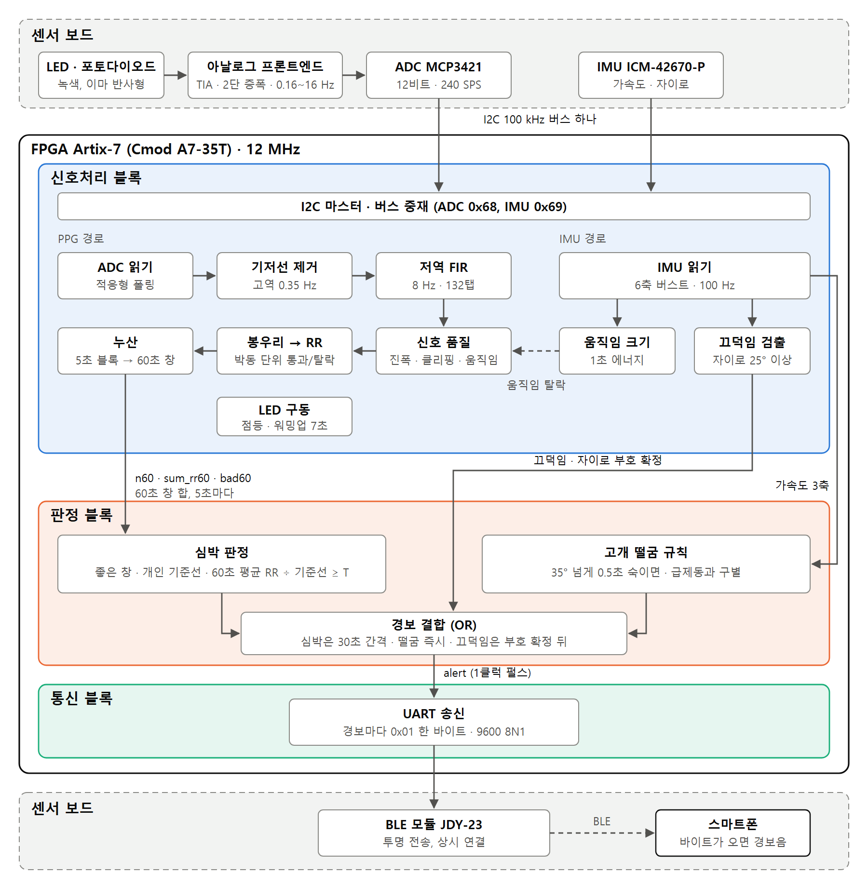

# 3. 설계기술 설명

## 3.1 전체 구조

*그림 3.1 전체 구조. 센서 보드의 PPG·IMU 신호가 하나의 I2C 버스로 FPGA에 들어가고, 신호처리·판정·통신 세 블록을 거쳐 경보 1바이트로 나간다.*

시스템은 이마에 착용하는 센서 보드와 FPGA(Artix-7, Cmod A7-35T) 두 부분이다. 센서 보드의 광원·포토다이오드·아날로그 프론트엔드가 맥파를 전압으로 바꾸고, ADC(MCP3421)와 IMU(ICM-42670-P)가 한 I2C 버스로 FPGA에 값을 넘긴다. FPGA 안에서는 세 블록이 차례로 일한다.

| 블록 | 하는 일 | 내보내는 것 |
|---|---|---|
| 신호처리 블록 | I2C로 ADC·IMU 읽기, 필터, 신호 품질 검사, 봉우리 검출과 심박 간격(RR) 추출, 5초 블록 누산, 자이로 끄덕임 검출, LED 구동 | 5초마다 60초 창 합 3개(박동 수, RR 합, 탈락 박동 수), 가속도 3축, 끄덕임 결과 |
| 판정 블록 | 개인 기준선, 각성도 저하 판정, 고개 떨굼 판정, 경보 결합 | 경보 펄스 `alert` |
| 통신 블록 | 경보 펄스마다 UART로 1바이트 송신 | BLE 모듈로 `0x01` |

BLE 모듈(JDY-23)은 받은 바이트를 스마트폰으로 그대로 전달하고, 스마트폰은 바이트가 오면 경보음을 낸다. 판단은 전부 칩 안에서 끝나고 밖으로는 결과만 나간다.

### 블록 사이 인터페이스

| 경계 | 신호 | 폭 | 주기 |
|---|---|---|---|
| 센서 보드 → 신호처리 | I2C SCL·SDA (ADC 0x68, IMU 0x69) | 2선 | 100 kHz. ADC 240 SPS, IMU 100 Hz |
| 신호처리 → 판정 | `n60`, `sum_rr60`, `bad60` + 갱신 펄스 | 8, 17, 8 | 5초마다 |
| 신호처리 → 판정 | 가속도 3축 + 갱신 펄스 | 16 × 3 | 100 Hz |
| 신호처리 → 판정 | 끄덕임 펄스, 떨군 채 유지, 자이로 부호 확정 | 1, 1, 1 | 사건마다 |
| 판정 → 통신 | `alert` | 1 | 경보마다 1클럭 펄스 |
| 통신 → 센서 보드 | UART TX, BLE_WAKE | 1, 1 | 9600 bps 8N1, BLE_WAKE는 High 고정 |
| FPGA → 센서 보드 | LED 점등 | 1 | 측정 중 상시 |

심박 간격은 칩 안에서 전부 샘플 수(240 SPS, 1샘플 = 4.17 ms)로 다루고 시간 단위로 바꾸지 않는다. 판정은 비율로 하므로 ADC 내부 발진기 오차가 상쇄된다.

신호처리 블록은 심박 간격 값을 저장하지 않는다. 5초마다 누산기 한 벌을 닫아 최근 12벌을 시프트 레지스터에 보관하고 그 합으로 60초 창을 만든다. 판정 블록은 이 60초 창 합 세 개만 받아 판정하므로, 블록 사이로 오가는 심박 정보는 5초에 33비트다.

### 클럭, 리셋, 핀

전체가 12 MHz 단일 클럭 도메인이다. 리셋은 버튼 대신 컨피규레이션 직후 16클럭 동안 내리는 파워온 리셋을 쓴다. FPGA 핀은 여섯 개(클럭, SCL, SDA, LED, BLE 송신, BLE_WAKE)이고, 센서 보드의 헤더를 Cmod A7의 Pmod 소켓에 직결한다.

> 확인: 헤더 줄 방향(XDC 배치 1/2)은 실물 확인 전이다.

### 자원

Vivado 2026.1, xc7a35t, 시스템 최상위 배치·배선 결과(12 MHz).

| | LUT | DSP48E1 | BRAM | 비고 |
|---|---|---|---|---|
| 신호처리 블록 | 3,413 | 1 | 1 | FIR 곱셈기 시분할 1, 기저선 제거 지연선 |
| 판정 블록 | 207 | 3 | 0 | 판정식 교차 곱셈 3 |
| 통신 블록 | 14 | 0 | 0 | |
| **합계** | **3,634 (17.5%)** | **4** | **1** | FF 3,656 (8.8%), WNS 54.8 ns (주기 83.3 ns) |

통신 블록 LUT는 합계에서 두 블록을 뺀 값이다. 게이트 수로 환산하면(Yosys) 시스템 전체 약 5.5만 NAND2와 메모리 약 14 kbit, 판정 블록 약 7천 NAND2다.
