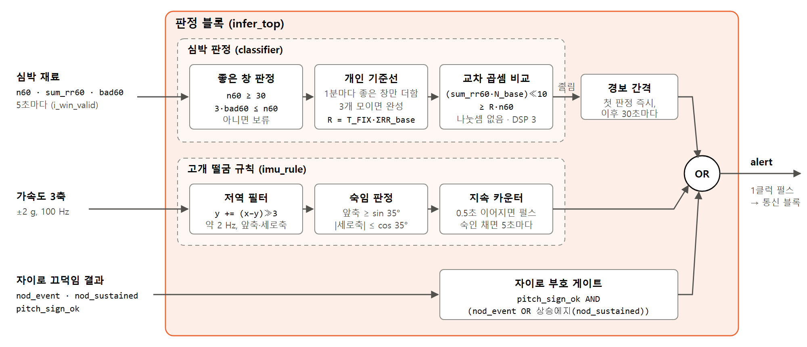
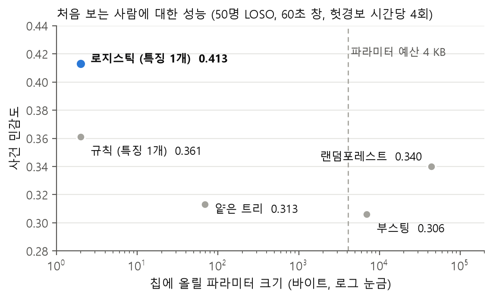
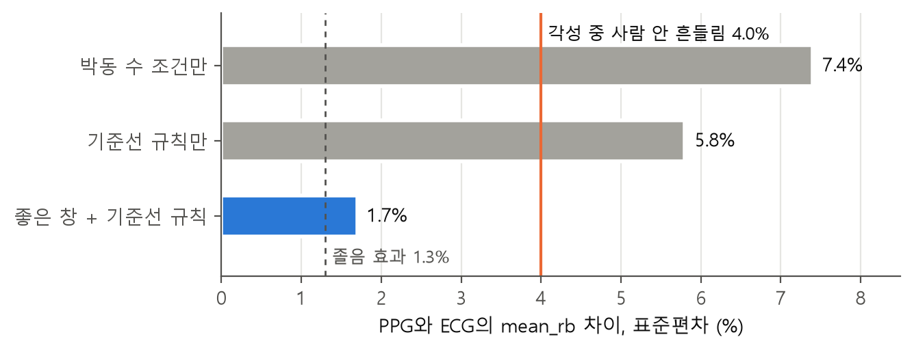
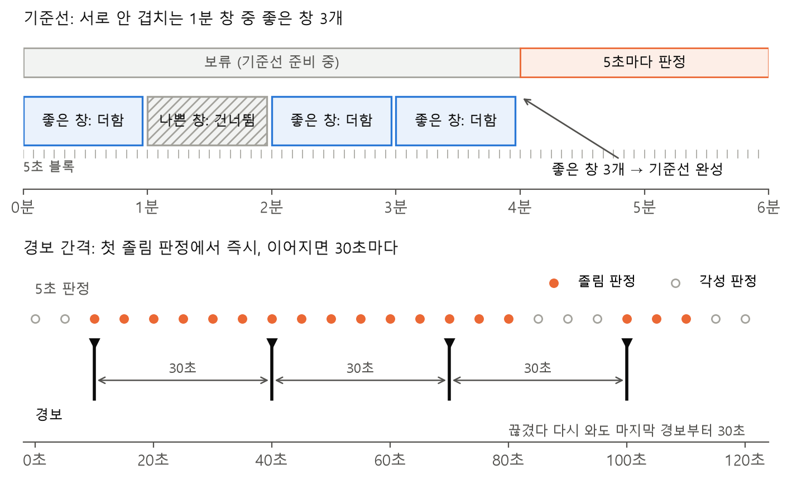
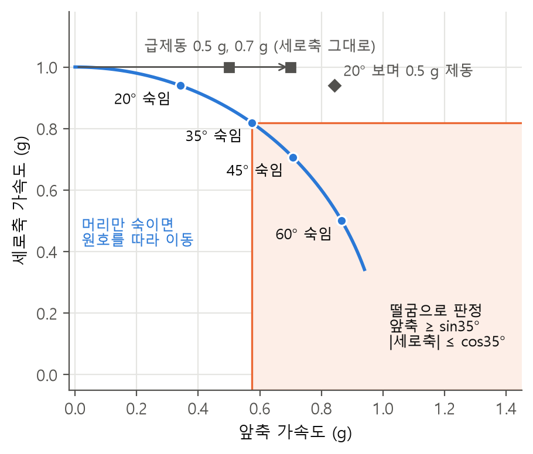

## 3.4 판정 블록

판정 블록은 두 갈래 입력을 받는다. 신호처리 블록이 5초마다 주는 심박 재료(60초 창 합 세 개)와 100 Hz로 오는 IMU 신호다. 두 갈래는 각자 판단한 뒤 경보 단계에서만 만나 경보 펄스 하나로 통신 블록에 넘어간다. 판정 블록이 학습한 값은 문턱 하나(11비트)이고 나머지는 전부 설계로 정한 규칙이다.

판정 블록의 결정은 아래 여섯 가지 기준을 따랐다.

| 기준 | 내용 |
|---|---|
| J1 | 놓침 방지를 우선한다. 졸음 구간 안에서 한 번이라도 경보했는지(사건 민감도)를 주 지표로, 각성 시간당 헛경보를 짝으로 본다 |
| J2 | 처음 보는 사람에게 통해야 한다. 평가는 사람 단위로 분리한다 |
| J3 | 하드웨어 비용을 모델 선정 기준에 넣는다. 예산은 양산 칩 기준 파라미터 4 KB, 판정당 곱셈 1만 회, 곱셈기 시분할 1개 |
| J4 | 입력은 파형에서 나온 것만 쓴다. 뇌파·경과 시간·피험자 정보는 칩이 가질 수 없다 |
| J5 | 판정마다 각각 판단한다. 연속 N회 규칙과 이력(hysteresis)을 쓰지 않는다. 30초짜리 졸음 구간이 23%라 연속 조건을 걸면 짧은 구간을 놓친다 |
| J6 | 회로가 모델을 정확히 구현했는지 비트 단위로 확인할 수 있어야 한다 |

채점은 발작 검출의 사건 채점 표준[40][41]을 30초 라벨에 맞춰 쓴다. 정확도는 쓰지 않는다. 전부 "각성"이라 답해도 76.8%가 나오기 때문이다.

### 3.4.1 구조와 인터페이스



*그림 3.4.1 판정 블록 구조. 심박 판정과 고개 떨굼 규칙이 각자 판단하고 경보 단계에서 OR로 합쳐진다.*

| 모듈 | 하는 일 |
|---|---|
| 심박 판정 (`classifier`) | 좋은 창 판정, 개인 기준선 누산, 60초 평균 RR ÷ 기준선 평균 RR ≥ T를 교차 곱셈으로 비교. 5초마다 보류(`hold`)·졸림(`drowsy`) |
| 고개 떨굼 규칙 (`imu_rule`) | 가속도로 숙인 자세를 본다. 35° 넘게 0.5초면 펄스, 숙인 채 있으면 5초마다 |
| 최상위 (`infer_top`) | 둘을 감싸고 심박 경보 간격, 자이로 부호 게이트, OR로 `alert` 하나를 낸다 |

| 방향 | 신호 | 폭 | 뜻 |
|---|---|---|---|
| 입력 | `i_win_valid` | 1 | 5초마다 1클럭. 아래 셋이 이 클럭에 유효 |
| 입력 | `i_n60`, `i_sum_rr60`, `i_bad60` | 8, 17, 8 | 60초 창 통과 박동 수, RR 합(샘플 수), 탈락 박동 수 |
| 입력 | `i_accel_x/y/z`, `i_imu_valid` | 16 × 3, 1 | ±2 g(1 g = 16384), 100 Hz |
| 입력 | `i_nod_event`, `i_nod_sustained`, `i_pitch_sign_ok` | 1, 1, 1 | 자이로 끄덕임(펄스), 떨군 채 유지(상태), 자이로 부호 확정(상태) |
| 출력 | `alert` | 1 | 경보, 1클럭 펄스 |
| 출력 | `ready` | 1 | 기준선 확정(상태 표시용) |

```
alert = (판정 갱신 AND drowsy AND NOT hold AND 마지막 심박 경보로부터 5초 블록 6개 이상)
      | 자세 규칙 펄스
      | pitch_sign_ok AND (nod_event | rise(nod_sustained))
```

| 파라미터 | 값 | 뜻 |
|---|---|---|
| `T_FIX`, `FRAC` | 1086, 10 | 문턱 T × 1024, 소수 비트 |
| `WIN_BLOCKS` | 12 | 60초 창 = 5초 블록 12개 |
| `BASE_WINS` | 3 | 기준선 = 좋은 1분 창 3개 |
| `MIN_N60` | 30 | 좋은 창의 최소 박동 수 |
| `KEEP_K` | 3 | 좋은 창의 탈락 기준(살린 박동 75%) |
| `REPEAT_BLOCKS` | 6 | 심박 경보 간격(30초) |

출력을 상태가 아닌 펄스로 둔 것은 통신 블록이 "펄스가 오면 한 바이트"만 하면 되게 하기 위해서다. 심박 재료가 세 개뿐인 것은 모델 선정(3.4.2)의 결과다. 특징 후보를 위해 계획했던 누산기 다섯 개(N, ΣRR, ΣRR², Σd, Σd²) 중 N과 ΣRR만 남았고, 이마 PPG 창 품질을 위한 탈락 박동 수가 더해졌다.

### 3.4.2 심박 판정 방식

**학습 데이터.** PPG와 졸음 라벨이 함께 있는 공개 데이터는 없다. 그래서 심박 간격(RR)이라는 공통 표현으로 ECG 데이터에서 배우고, 이마 PPG에서 같은 값이 나오는지를 따로 확인하는 구조를 택했다.

| 데이터 | 역할 | 내용 |
|---|---|---|
| MPD-DF[31] | 학습·평가 | 50명, 시뮬레이터 2시간, ECG 1024 Hz, 의사 뇌파 판독 30초 라벨 |
| WildPPG[37] | 이마 PPG 전이 확인 | 16명, 흉골 ECG + 이마 PPG + 이마 가속도 동시 기록, 졸음 라벨 없음 |
| PPG-DaLiA[32] | 움직임 영향, 떨굼 규칙 헛울림 확인 | 15명, 손목 PPG + 가슴 ECG + 가속도, 운전 구간 포함 |

라벨이 30분 간격인 데이터와 ECG가 칩(240 SPS)보다 거친 128 Hz 데이터는 쓰지 않았다. 학습용 RR은 ECG를 보드 아날로그 프론트엔드와 같은 대역으로 거르고 240 Hz로 낮춘 뒤 정수 연산만 쓰는 봉우리 규칙으로 뽑았다(50명 놓침 1.0%, 오검출 3.2%).

**모델 선정.** 특징 후보는 HRV 표준 문서[33]의 시간영역 지표에서 30초 창 성립, ECG·PPG 공통, 240 SPS 분해능[35][36] 세 조건으로 거른 14개다. 모든 특징은 5초 블록 누산 재료만으로 계산해 파이썬과 회로가 같은 값을 내게 했다. 모델 후보는 규칙(특징 1개 + 문턱), 얕은 결정트리, 로지스틱 회귀, 랜덤포레스트, 부스팅 트리이고, 50명을 한 명씩 빼는 교차검증(LOSO)으로 같은 채점기에서 비교했다. 시험 피험자는 학습·특징 선택·문턱 선택 전 과정에서 보지 않는다.



*그림 3.4.2 모델 크기 대 사건 민감도. 파라미터가 가장 작은 로지스틱 회귀가 가장 높고, 예산을 넘는 트리 앙상블은 오히려 낮다.*

| 모델 (60초 창) | 사건 민감도, 헛경보 2회/h | 4회/h | 파라미터 |
|---|---|---|---|
| 규칙 | 0.188 | 0.361 | 2 B |
| 얕은 트리 | 0.181 | 0.313 | 69 B |
| **로지스틱 (특징 1개)** | **0.265** | **0.413** | **2 B** |
| 랜덤포레스트 | 0.206 | 0.340 | 44,168 B |
| 부스팅 | 0.188 | 0.306 | 6,975 B |

작을수록 나았다. 랜덤포레스트는 예산의 11배를 쓰고도 로지스틱에 졌고, 크기만 줄인 실험에서도 깊이 1 트리가 제약 없는 트리보다, 나무 4그루가 200그루보다 높았다. 큰 모델은 학습 49명을 외울 뿐 새 사람에게 옮겨 가지 않았다.

| | |
|---|---|
| 기준 | J1, J2, J3 |
| 선택 | 로지스틱 회귀, 특징 `mean_rb` = 60초 창 평균 RR ÷ 개인 기준선 평균 RR, 60초 창, 헛경보 시간당 4회 동작점 |
| 결과 | 특징이 하나면 로지스틱 회귀는 단조 함수라 `mean_rb ≥ T`와 같다. 칩에 들어가는 파라미터는 T 하나다 |
| 대가 | 판별력 상한. 상한을 정하는 것은 모델이 아니라 신호다(아래) |

60초 창은 30초 창과 사건 민감도가 같으면서 졸린 동안 경보가 켜져 있는 비율이 일관되게 높아 골랐다. 헛경보 4회/h는 교차검증 폴드 사이에서 문턱이 안정적이어서 골랐다.

성능은 사건 민감도 0.413 [0.28–0.53], 더 깊은 단계(피로 2단계 이상)까지 간 구간 0.633 [0.48–0.80]이다(피험자 부트스트랩 95% 구간). EU 규정의 합격선은 평균 민감도 40% 초과, 90% 신뢰구간 하한 20% 초과다[38]. 시뮬레이터 데이터이고 라벨 체계가 달라 "규정을 통과한다"고 쓰지는 않는다.

**성능이 이 정도인 이유.** 졸음이 만드는 `mean_rb` 변화는 1.3%인데 같은 사람이 깨어 있을 때의 흔들림이 4.0%다. 신호대잡음비 0.33에서 나오는 이론 AUC는 0.59이고 실측은 0.60이다. 특징 14개를 다 쓰고 학습 데이터로 채점해도 0.647이다. 사람을 분리해 평가한 심박 단독 연구도 0.6 언저리이고[34], 샘플링을 높여도 평균 RR 오차는 이미 효과의 10분의 1 아래다[35]. 병목은 측정도 모델도 아니라 생리다.

**이마 PPG로 옮기기.** 칩은 이마 PPG를 신호처리 블록의 검출기(칩 검출기)로 보고, 학습은 ECG를 파이썬 검출기(학습 검출기)로 봤다. 같은 검출기로 통일할지가 갈림길이었다.

| | |
|---|---|
| 기준 | 문턱은 참값에 가까운 RR로 잡는다(J2). 칩에서는 이마 PPG에서 동작해야 한다 |
| 후보 | 칩 검출기로 통일 / 학습 검출기로 통일 / 신호마다 따로 두고 `mean_rb`로 연결 |
| 선택 | 신호마다 따로 |
| 대가 | 두 경로가 같은 `mean_rb`를 내는지 따로 증명해야 한다 |

칩 검출기를 ECG에 쓰면 50명 중 11명에서 T파를 봉우리로 잡아, 그 RR로 잡은 문턱의 교차검증 사건 민감도가 0.401에서 0.237로 무너졌다. 반대로 학습 검출기는 이마 PPG에서 첫 포화 아티팩트 뒤 문턱이 내려오지 않아 커버리지가 0%였다. 칩 검출기는 이마 PPG에서 커버리지 77~83%, 평균 RR 편향 −0.1%다. 검출기가 달라도 되는 이유는 `mean_rb`가 60초 평균의 비율이라, 봉우리 위치의 일정한 지연과 박동별 흔들림이 평균과 비율에서 상쇄되기 때문이다.

같은 사람, 같은 시각에 흉골 ECG로 낸 `mean_rb`와 이마 PPG(칩 검출기의 비트 정확 모델)로 낸 `mean_rb`를 칩 판정 절차 그대로 비교했다(WildPPG 15명, 1명당 12~15시간 야외 활동).



*그림 3.4.3 같은 시각 이마 PPG와 흉골 ECG의 `mean_rb` 차이. 판정 규칙을 넣으면 차이가 각성 중 생리적 흔들림보다 작아진다.*

| | 박동 수 조건만 | 좋은 창 + 기준선 규칙 |
|---|---|---|
| 차이 중앙값 | −3.1% | −0.1% |
| 차이 표준편차 | 7.4% | 1.7% |
| 판정 일치 | 사람별 50~97% | 97.4% (사람별 92~100%) |

이 비교에서 박동을 많이 버린 창과 그런 창으로 만든 기준선이 판정을 틀리게 한다는 것이 드러났고, 3.4.3의 좋은 창·기준선 규칙이 여기서 나왔다. 학습 데이터(MPD-DF)에 두 규칙을 넣어도 판정 블록 99.8%가 남고 문턱은 그대로다.

### 3.4.3 심박 판정 규칙



*그림 3.4.4 위: 기준선은 서로 안 겹치는 1분 창 중 좋은 창 3개로 만든다. 아래: 심박 경보는 첫 졸림 판정에서 즉시, 이어지면 30초마다 낸다.*

**좋은 창.**

```
좋은 창:  n60 ≥ 30  그리고  3 × bad60 ≤ n60      (살린 박동 75% 이상)
```

접촉이 나쁜 이마 PPG 창은 박동 절반 이상을 버리고도 박동 수 조건을 통과하고, 남은 박동이 한쪽으로 쏠려 창 평균이 흔들린다. 75%는 정확도로 정했다. PPG-DaLiA 운전 구간에서 조건이 없으면 창 평균 RR 오차 표준편차가 10.5%, 75%면 2.2%다. 문턱은 파라미터 `KEEP_K`(3 = 75%, 2 = 67%, 1 = 50%, 0 = 끔)로 두어 보드 실측 뒤 조정한다. `3 × bad60`은 시프트와 덧셈이다.

**개인 기준선.**

```
12·24·36·…번째 블록(서로 안 겹치는 1분 창)마다 그 창이 좋은 창이면
    N_base += n60,  ΣRR_base += sum_rr60
좋은 창 3개가 모이면  R = T_FIX × ΣRR_base  (곱셈 1회), 준비 완료
나쁜 창은 건너뛰고 다음 1분 창을 기다린다 (최소 3분, 재시작 없음)
```

신호처리 블록은 5초마다 갱신되는 60초 창 합만 준다. 12블록 간격의 창은 서로 겹치지 않으므로 그 창 합을 더하면 분 합이 정확히 나온다. 그래서 5초 블록 값을 따로 받는 포트를 늘리지 않았다. 기준선을 운행 중에 계속 따라가게 하는 방식도 시험했으나 쓰지 않는다. 누적 갱신이나 10분·20분 기준선으로 바꾸면 사건 민감도가 크게 떨어졌다(로지스틱 30초 창, 헛경보 4회/h에서 0.404가 각각 0.212, 0.268, 0.290). 졸린 사람의 기준선이 졸음 쪽으로 끌려가 경보가 멈추기 때문이다.

**보류.** 기준선 준비 전(완성되는 블록 포함)이거나 좋은 창이 아니면 `hold = 1`, 이때 `drowsy = 0`이다. 신호처리 블록의 신호 품질 플래그는 따로 쓰지 않는다. 탈락 박동은 이미 `n60`·`sum_rr60`에서 빠져 있고 그 수가 `bad60`으로 들어오기 때문이다. 보류는 블록 안에서 삼켜지고 밖으로 나가지 않는다.

**경보 간격.**

| | |
|---|---|
| 기준 | 첫 경보를 늦추지 않는다(J5). 같은 증거로 여러 번 울리지 않는다 |
| 후보 | 졸림 판정마다(5초) / 연속 N회 뒤 / 첫 판정에서 즉시, 이어지면 일정 간격 |
| 선택 | 첫 판정에서 즉시, 이어지면 30초(창의 절반)마다. 끊겼다 다시 와도 마지막 경보 시각만 본다 |
| 대가 | 스마트폰은 경보의 원인(심박인지 떨굼인지)을 모른다 |

판정 하나가 최근 60초를 보므로 5초마다 연달아 나온 판정은 60초 중 55초가 같은 데이터다. EU 규정은 첫 경고를 빨리 내고 확인될 때까지 반복할 수 있게 하되 간격 수치는 두지 않는다[38]. 반복이 잦으면 경고에 둔감해진다[39]. MPD-DF 50명에서 스마트폰이 받는 경보는 깨어 있을 때 시간당 139번에서 26번으로, 피로 1단계 이상일 때 246번에서 45번으로 줄고, 경보 가운데 실제 피로 1단계 이상에서 난 비율은 34%로 같다. 간격은 판정과 판정 지표를 바꾸지 않는다. 떨굼 경보는 이 간격을 적용받지 않는다.

**감수한 것.** 규칙은 신호가 나쁜 창을 판정하지 않으므로 판정 빈도가 준다. 두 규칙에서 남는 판정 창은 WildPPG(이마, 야외 활동) 약 38%, PPG-DaLiA(손목, 실제 운전) 26%이고, 이마로 운전하는 조건의 데이터는 없다. 조건 없이 두면 판정은 많지만 창 절반 이상이 졸음 신호(1.3%)보다 크게 틀린 상태이므로, 규칙은 원래 믿을 수 없던 판정을 드러내는 것이다. 접촉이 나쁜 동안과 기준선 준비 중(최소 3분)에는 심박 경보가 없고, 떨굼 경보는 그와 무관하게 울린다.

### 3.4.4 고개 떨굼 규칙

심박 판정은 60초 창이라 초 단위 사건에 늦고, 보류 중에는 판정하지 않는다. 고개 떨굼은 IMU가 직접 본 사건이라 즉시, 보류와 무관하게 울린다. 착용 데이터가 없으므로 임계값은 문헌·물리·센서 사양에서 정했다.

**떨굼 정의.** 머리가 θ만큼 숙이면 앞축 가속도는 g·sin θ로 늘고 세로축은 g·cos θ로 준다. 차의 가감속은 앞축에 그대로 더해져, 급제동 0.5 g는 30° 숙임과 앞축 크기가 같다. 제동은 세로축을 바꾸지 않으므로 세로축이 둘을 가르는 수단이다.



*그림 3.4.5 앞축·세로축 가속도 평면. 머리만 숙이면 원호를 따라 판정 영역에 들어가고, 급제동은 세로축이 그대로라 들어가지 않는다.*

| | |
|---|---|
| 기준 | 급제동·계기판 보기에 울리지 않는다. 곱셈 없이. 착용 방향에 강하다 |
| 후보 | A. 앞축 기울기 + 지속시간 / B. 연속 샘플 급변 / C. A + 세로축 조건 |
| 선택 | C. 약 2 Hz 저역 뒤 앞축 ≥ sin35°(0.574 g) 그리고 세로축 ≤ cos35°(0.819 g)가 0.5초 이어지면 펄스, 숙인 채 있으면 5초마다 |
| 대가 | 0.5초 안에 돌아오는 꾸벅임은 못 잡는다(자이로가 맡는다). 35°는 착용 실측으로 확인되지 않았다 |

구조는 안경형 상용품 특허(세로축 중력 투영, 약 2 Hz 저역, 지속시간)[42]를 따랐고, 35°는 센서 내장 기울기 감지의 고정값이다[43]. B의 근거 문헌[28]은 센서 설정 범위를 넘는 값을 보고하는 등 임계값을 쓸 수 없었다.

```
매 i_imu_valid (100 Hz):
  lp_f += (a_fwd − lp_f) >>> 3        1차 IIR, 약 2.1 Hz
  lp_v += (a_vert − lp_v) >>> 3
  tilt  = (lp_f ≥ 9397) && (|lp_v| ≤ 13420)
  cnt   = tilt ? cnt + 1 : 0
  cnt가 50(0.5초)에 닿으면 펄스, 550에 닿으면 펄스 후 50으로 (이후 5초마다)
```

덧셈 2, 비교 3, 10비트 카운터이고 곱셈이 없다. 세로축은 절댓값이라 헤드밴드를 뒤집어 써도 같다. 축 선택·부호·문턱·시간은 전부 파라미터라 실물 확인 뒤 바꿀 수 있다.

**자이로 끄덕임과의 결합.** 신호처리 블록은 자이로로 빠른 꾸벅임(25° 이상, 하강 뒤 복귀)을 따로 잡는다(3.3.6). 두 규칙은 서로 못 잡는 것을 채운다.

| | 자이로 끄덕임 (신호처리 블록) | 가속도 자세 규칙 (판정 블록) |
|---|---|---|
| 잡는 것 | 빨리 떨어졌다 돌아오는 꾸벅, 25° 이상 | 숙인 채 있음, 35° 이상 0.5초 |
| 천천히 처짐 | 못 잡음 | 잡음 |
| 떨군 채 계속 | 한 번 | 5초마다 |
| 급제동 | 면역 | 세로축으로 구별 |
| 착용 방향 | 부호를 런타임에 판별해야 함 | 센서 패키지 방향으로 고정 |

둘을 OR 하되 자이로 쪽은 부호가 확정된 뒤에만 받는다. 확정 전에는 부호를 +1로 가정하고 돌아, 반대로 쓴 경우 꾸벅임을 놓치거나 고개를 든 자세에서 "떨군 채 유지"가 설 수 있기 때문이다. 문턱을 25°와 35°로 나눈 것은 둘이 같으면 OR의 의미가 없어서다.

**움직임이 클 때 판정을 보류하지 않는다.** PPG-DaLiA 15명(손목 PPG, 가슴 ECG 정답)에서 움직임 보류 없이 판정 뒤집힘은 3.2%이고, IMU로 보류를 더해도 2.9%다. 신호처리 블록의 신호 품질 검사와 움직임 탈락이 움직임 구간의 나쁜 박동을 이미 거르기 때문이다(0.5~1 g 흔들림에서 평균 RR 오차가 검사 없이 11.4%, 검사 뒤 2.6%). 초기 졸음에서 머리 움직임이 늘어난다는 보고도 있어[29], 움직임으로 보류하면 졸음 구간을 먼저 잃을 수 있다. 그래서 IMU는 떨굼만 보고, 심박 갈래와는 경보 단계에서만 만난다.

### 3.4.5 정수 구현과 검증

**교차 곱셈으로 나눗셈을 없앤다.**

```
mean_rb = (sum_rr60 / n60) ÷ (ΣRR_base / N_base) ≥ T
양변에 n60 × N_base × 1024 를 곱하면
(sum_rr60 × N_base) << 10  ≥  (T_FIX × ΣRR_base) × n60
```

| | A. 나눈 뒤 곱하기 | B. 교차 곱셈 (채택) |
|---|---|---|
| 기준선 완성 시 | 평균 `B = ⌊ΣRR_base ÷ N_base⌋`, `K = (T_FIX × B) >> 10` | `R = T_FIX × ΣRR_base` (곱셈 1회) |
| 매 5초 | `sum_rr60 ≥ K × n60` | `(sum_rr60 × N_base) << 10 ≥ R × n60` |
| 회로 | 나눗셈기 1개 + 곱셈 1개 | 곱셈 3개(R 1회, 좌·우변), 나눗셈 없음 |
| 근사 | 평균 절단(최대 1샘플 = 0.4%) + K 절단 + T 반올림 | T 반올림 하나 |

졸음 효과가 1.3%라 평균 절단 0.4%는 무시할 수 없다. B는 원래 부등식의 양변에 양수를 곱한 것이라 정수 비교가 실수 비교와 정확히 같고, 유일한 근사는 T를 1/1024 단위로 둔 것이다. 그래서 파이썬 정수 기준 모델과 Verilog가 같은 식을 쓰면 비트 일치가 곧 모델 일치다(J6).

**T의 정밀도: 소수 10비트, T_FIX = 1086.** 배포용 T는 50명 전체에 헛경보 4회/h를 맞춘 1.06017이다. 정수는 "4회/h 이하를 지키는 가장 작은 값"으로 골랐다.

| 소수 비트 | T_FIX | T | 헛경보/h | 사건 민감도 | 실수 T와 판정이 갈린 블록 | 좌/우변 폭 |
|---|---|---|---|---|---|---|
| 실수 | – | 1.06017 | 3.96 | 0.385 | 0 | – |
| 8 | 272 | 1.06250 | 3.87 | 0.374 | 735 (1.01%) | 35 / 33 |
| **10** | **1086** | **1.06055** | **3.95** | **0.381** | **120 (0.16%)** | **37 / 35** |
| 12 | 4342 | 1.06006 | 3.98 | 0.385 | 35 (0.05%) | 39 / 37 |

갈린 블록의 `mean_rb`는 전부 두 T 사이에 있다. 정밀도 손실이 아니라 문턱이 격자 위로 옮겨 간 것이다. 실수 T의 넷째 자리는 50명 표본이 검증해 주는 값이 아니라 12비트까지 갈 근거가 약하다.

**비트 폭.**

| 신호 | 폭 | 최대값 근거 |
|---|---|---|
| `n60`, `sum_rr60`, `bad60` | 8, 17, 8 | 신호처리 블록 출력(3.3.5) |
| `N_base` | 10 | 3 × 255 = 765 |
| `ΣRR_base` | 16 | 3 × (60 s × 240 + 360) = 44,280 |
| `T_FIX` | 11 | 1086 < 2048 |
| `R` | 27 | 11 + 16 |
| 좌변 | 37 | 17 + 10 + 10 |
| 우변 | 35 | 27 + 8 |

**곱셈기와 타이밍.**

| | |
|---|---|
| 기준 | 자원과 지연. 판정은 5초에 한 번이라 속도는 제약이 아니다 |
| 후보 | 곱셈기 3개 따로 / 하나를 순서 제어로 공유 |
| 선택 | 따로 둔다 |
| 대가 | DSP48E1 3개 점유(xc7a35t에 90개) |

FPGA에서 곱셈은 미리 박힌 DSP 블록에 배정되므로 셋을 써도 LUT는 늘지 않는다. 공유하면 DSP가 1개로 줄지만 먹스·순서 제어·배선에 LUT 30~60개가 더 들고 2클럭 늦어진다. ASIC으로 옮기면 공유 곱셈기도 최대 폭(27×16)이 필요해 절약이 20%대에 그치므로, 그때는 직렬(시프트·덧셈) 곱셈기가 맞다. R은 상수 곱(1086 = 1024 + 64 − 2)이라 시프트·덧셈 세 번으로도 바꿀 수 있다.

판정은 파이프라인 없이 세 클럭으로 나뉜다. 갱신 펄스 클럭에 입력을 잡아 기준선을 갱신하고, 다음 클럭에 곱셈, 그다음 클럭에 비교해 판정이 나온다. 경보는 그다음 클럭에 뜬다. 블록 간격이 6만 클럭이라 여유가 충분하다.

**검증.** 정답은 라벨이 아니라 파이썬 정수 기준 모델이다. 모델 성적은 3.4.2에서 확인했고, 여기서는 회로가 그 모델을 정확히 구현했는지만 본다. 테스트벤치는 파형 없이 5초 펄스와 세 값만 넣으므로 50명 전부를 2초에 돈다.

| 대상 | 방법 | 결과 |
|---|---|---|
| 심박 판정·경보 | MPD-DF 50명의 5초 블록 전부 75,186 + 경계 사례 278 | `hold`·`drowsy`·`alert` 불일치 0 |
| 경계 사례 | 양변이 정확히 같을 때(≥이므로 졸림)와 ±1, 박동 수 29/30·0·255, RR 합 최대, `3 × bad60 = n60`, 탈락 수 255, 나쁜 창을 건너뛰는 기준선, 누산 상한 근처, 경보 간격 | 불일치 0 |
| 테스트벤치 자체 | 파라미터를 일부러 틀림 | `T_FIX` 1087, `MIN_N60` 31, `REPEAT_BLOCKS` 5 각각 검출. `KEEP_K` 2는 567블록, `BASE_WINS` 2는 4,772블록 불일치 |
| 판정 → 통신 | 50명 벡터를 넣고 통신 블록 출력을 UART 수신기로 받음 | 경보 3,154개 = 바이트 3,154개, 전부 `0x01`, 프레이밍 오류 0 |
| 고개 떨굼 규칙 | 합성 16 시나리오 11,590샘플, 필터·카운터 레지스터를 샘플마다 대조 | 불일치 0. 급제동 0.5·0.7 g, 계기판 20°, 0.3초 꾸벅, 좌우 흔들기, 뒤로 젖힘, 20° 보며 제동에서 0회. 40° 1초 떨굼 1회, 50° 20초 잠듦 4회 |
| 고개 떨굼 헛울림 | PPG-DaLiA 가슴 가속도(이마 대용) 15명 35.9시간, 그중 1명 921,200샘플은 RTL 대조 | 운전 3.8시간에서 0회. RTL 불일치 0 |

칩 동작 그대로(정수 문턱 + 판정 규칙) 50명을 다시 채점하면 사건 민감도 0.379, 깊은 구간 0.567, 헛경보 3.94회/h다. 교차검증 값(0.413)보다 낮은 것은 사람마다 다른 폴드 문턱 대신 하나의 정수 문턱을 쓰고 창 품질 규칙이 더해졌기 때문이다. 문턱을 정한 데이터로 다시 채점한 값이라 새 사람에 대한 성능이 아니라 구현이 모델을 재현한다는 확인이다.

**합성 결과.** Vivado 2026.1, xc7a35t, 12 MHz.

| 대상 | LUT | FF | DSP | BRAM | WNS |
|---|---|---|---|---|---|
| 판정 블록 단독 (out-of-context) | 305 (1.47%) | 107 | 3 | 0 | 72.3 ns (주기 83.3 ns) |
| 시스템 최상위에 통합 | 207 | 107 | 3 | 0 | 시스템 54.8 ns |

판정 블록은 시스템 LUT의 약 6%, 게이트 환산 약 7천 NAND2다. 학습 파라미터는 11비트 하나로, 모델 선정 때 잡은 예산 4 KB와 비교가 무의미할 만큼 작다.
