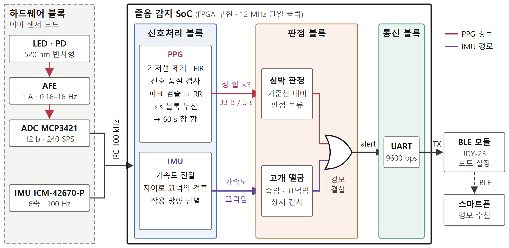

# 3. 설계기술 설명

## 3.1 시스템 구성

앞서 정한 구현 범위는 이마에 착용하는 센서 보드와, 센서 읽기부터 경보 송신까지를 처리하는 칩이다. 시스템은 이를 하드웨어 블록, 신호처리 블록, 판정 블록, 통신 블록의 네 블록으로 나누어 구성했다. 하드웨어 블록은 센서 보드의 광학·아날로그 회로와 PCB를 가리키고, 나머지 세 블록은 Verilog RTL로 설계하여 FPGA에 구현한 칩 내부 회로다. 이하에서는 신호가 흐르는 순서대로 각 블록의 설계와 검증을 설명하고, 마지막으로 칩 전체를 통합해 검증한 결과를 제시한다.

*그림 1. 시스템 전체 구조. PPG 경로와 IMU 경로는 판정 블록의 경보 결합에서만 만나며, 칩 밖으로는 경보만 나간다.*

하드웨어 블록에서는 LED와 포토다이오드가 이마의 맥파를 광전류로 받고, 아날로그 프론트엔드가 이를 증폭·필터링해 ADC로 넘긴다. ADC와 IMU는 하나의 I²C 버스에 연결되어, 칩이 초당 240개의 PPG 샘플과 초당 100회의 6축 관성 데이터를 읽는다. 칩 안에서 두 신호는 각자의 경로로 처리된다. 신호처리 블록은 PPG에서 박동 간격(RR)을 추출해 5초 단위로 누산하고, IMU에서는 가속도를 판정 블록에 전달하면서 자이로로 고개 끄덕임을 검출한다. 판정 블록은 심박 판정과 고개 떨굼 판정을 따로 수행한 뒤 두 결과를 OR로 결합해 경보 펄스 하나를 내고, 통신 블록은 경보마다 1바이트를 UART로 BLE 모듈에 보낸다. BLE 모듈은 센서 보드에 실장되어 있으며, 받은 바이트를 스마트폰 등 수신 단말로 전달한다. 판단에 필요한 처리는 모두 칩 안에서 끝나며, 칩 밖으로는 경보만 나간다.

> 확인: 그림·표 번호는 문서 전체에서 순서대로 매긴다(그림 1, 표 1 식, 9/30 사용자 결정). 3.1까지 표 1~3(2.1.3, 2.2.2, 2.4.1)과 그림 1. 본문에서 "그림 1에서"처럼 가리키는 것은 괜찮다. 팀원 원고(3.2부터)는 아직 개인 초안 번호(그림 2-2, 표 2-1 …)라 절을 다룰 때 이어서 다시 매긴다.

> 확인: 3.1은 지도라 그림과 두 문단으로 끝낸다. 블록별 기능·기준 대응 표와 PPG 데이터 감소(초당 2,880비트 → 5초에 33비트) 문단은 뺐다(9/30 사용자 결정, 기준 대응은 3.6 종합표와 각 블록 절에서). 클럭·리셋·핀(12 MHz 단일 클럭, 파워온 리셋 15클럭, FPGA 핀 6개)과 블록 간 신호 비트 폭은 3.6 시스템 최상위와 3.4.1에서 다룬다. 헤더 줄 방향(XDC 배치 1/2)은 실물 확인 전이다.

> 확인: 그림의 스마트폰은 "경보 수신"으로 적었다. 스마트폰 앱 수신과 경보음은 검증 범위 밖이다(3.5 한계).
