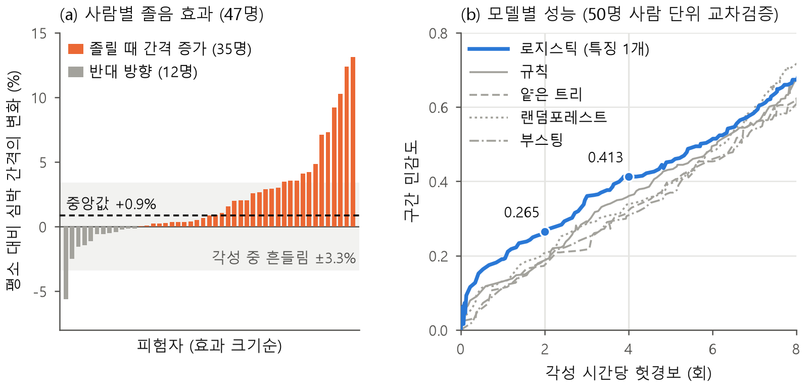
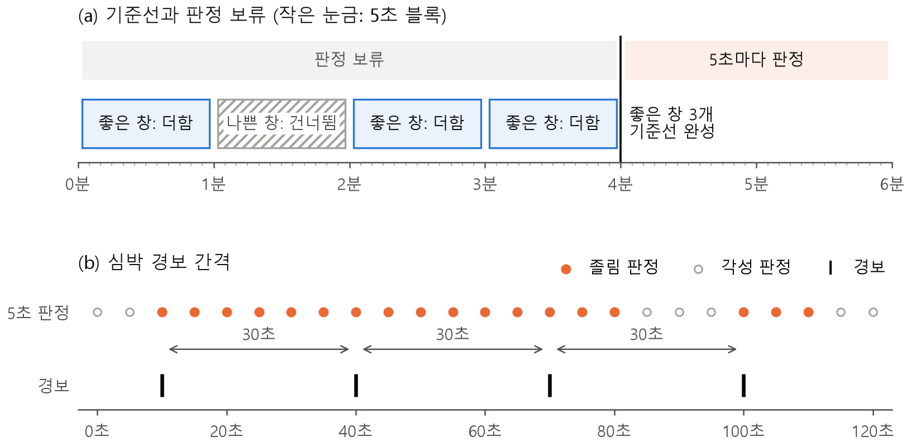

## 3.4 판정 블록

### 3.4.1 구조와 설계 기준

판정 블록은 신호처리 블록의 두 경로에서 입력을 받아 운전 중 각성도 저하를 판정하고 경보를 낸다. PPG 경로에서는 5초마다 최근 60초 동안(이하 창)의 통과 박동 수·박동 간격(RR) 합·탈락 박동 수를, IMU 경로에서는 100 Hz 가속도와 자이로로 검출한 끄덕임 신호를 받는다. 두 입력은 각각 심박 판정과 고개 떨굼 판정으로 처리되고, 결과는 경보 단계에서 하나의 펄스로 합쳐져 통신 블록으로 나간다(그림 1). 심박 판정은 창의 신뢰성 확인, 개인 기준선 대비 비교, 경보 간격 제어의 세 단계로 이루어진다.

이 구조는 앞서 정한 설계 기준 가운데 판정에 해당하는 기준을 다음과 같이 반영한다. 판정은 5초마다 최근 60초 데이터로 갱신하고(①), 개인 기준선 대비 비율을 써서 평소 심박의 개인차를 배제하며(②), 고개 떨굼은 심박 판정과 별도로 상시 감시한다(③). 신뢰할 수 없는 창에서는 심박 판정을 보류하고(④), 모든 연산은 나눗셈기와 블록 메모리 없는 정수 회로로 구현한다(⑥). 판정 성능은 학습에 쓰지 않은 사람의 데이터로, 각성 시간당 헛경보 4회 조건에서 구간 민감도[22][23]로 평가하였다.

### 3.4.2 학습 데이터 선정

심박 판정 규칙을 학습하고 평가하려면 각성도 저하가 언제 나타났는지 표시된 심박 데이터가 필요하다. 이에 따라 학습 데이터는 운전 중 각성도를 라벨로 기록한 데이터 가운데 세 가지 기준으로 골랐다. 라벨은 각성도 저하가 나타난 시점을 가려낼 수 있을 만큼 촘촘해야 한다. 라벨 간격이 길면 그 안의 각성 구간까지 각성도 저하로 학습되고 채점되기 때문이다. 또 라벨은 자기 보고가 아닌 객관적 판독에 근거해야 하고, 신호는 특징을 칩과 같은 조건에서 직접 계산할 수 있도록 원시 심박 파형이 칩의 표본화율(240 Hz) 이상으로 기록되어 있어야 한다. 이를 모두 충족한 것은 운전 시뮬레이터에서 50명을 2시간씩 기록한 MPD-DF[15]였다. 의사가 뇌파를 판독해 30초마다 피로 단계를 매겼고, ECG를 1024 Hz로 기록하였다. 판정 대상인 각성도 저하는 피로 1단계 이상이다.

다만 PPG와 각성도 라벨을 함께 기록한 공개 데이터는 조사한 범위에서 찾을 수 없었고, MPD-DF도 ECG 데이터다. 칩은 이마 PPG를 보므로 두 신호에 공통인 박동 간격을 매개로 삼았다. ECG의 R파와 PPG의 맥파는 같은 박동에서 나오므로, 두 신호에서 구한 박동 간격은 같은 심박 변화를 나타낸다. 이것이 실제 판정에서도 성립하는지는 흉골 ECG와 이마 PPG를 같은 사람에게서 동시에 기록한 WildPPG[24]의 15명(야외 활동)으로 확인하였다. 이마 PPG와 ECG를 각각 칩과 같은 판정 절차에 넣어 비교한 결과 두 판정이 97.4%(사람별 92~100%) 일치하였다. 이 데이터에는 각성도 라벨이 없으므로, 이 결과는 이마 PPG가 ECG와 같은 판정을 낸다는 확인이며 이마 PPG에서의 각성도 저하 검출 성능을 직접 보인 것은 아니다.

이처럼 MPD-DF는 세 기준을 충족하고, 이를 학습한 판정이 이마 PPG에서도 유지됨을 동시 기록 데이터로 검증하여 학습 데이터로 확정하였다.

### 3.4.3 특징과 모델 선정

확정한 데이터로 특징과 모델을 골랐다. 선정 기준은 앞서 세운 자원 대비 효과 원칙에 따라, 처음 보는 사람에 대한 성능과 함께 칩에 올릴 파라미터 크기와 판정당 곱셈 수로 두었다. 칩 안의 분류기는 저장할 파라미터와 연산 수가 회로 규모를 정하기 때문이다[25]. 특징 후보는 심박 변이도 표준[11]의 시간 영역 지표(평균 박동 간격, SDNN, RMSSD 등)와 이를 개인 기준선이나 30초 전 값에 견준 변형 가운데, 60초 안에 계산할 수 있고 ECG와 PPG에 공통이며 240 Hz 분해능으로 충분한[26][27] 14개였다. 모든 특징은 신호처리 블록이 5초마다 누산하는 합(박동 수·박동 간격 합·간격 제곱합·이웃 간격 차의 합과 제곱합)만으로 계산하도록 정의해, 박동 간격을 저장할 메모리 없이 누산기만으로 계산할 수 있게 하였다. 모델 후보는 규칙(특징 하나와 문턱)·얕은 결정트리·로지스틱 회귀·랜덤포레스트·부스팅 트리 다섯 가지이고, 판정에 쓰는 창의 길이는 30초와 60초를 후보로 두었다.

평가 지표는 경보 장치로서의 쓰임에 맞춰 정하였다. 심박 기반 졸음 검출 연구는 성능을 주로 창 단위 정확도로 보고해 왔다[12]. 그러나 이 데이터는 라벨의 77%가 각성이어서 모두 각성으로 판정해도 정확도가 77%에 이르므로, 정확도로는 각성도 저하 검출 능력을 가늠할 수 없다. 또 각성도 저하는 한 번에 수십 초에서 수 분(MPD-DF에서 중앙값 90초) 이어지는 구간으로 나타나므로, 판정 하나하나의 맞고 틀림을 세면 긴 구간 하나를 여러 번 맞힌 것과 짧은 구간 여러 개를 놓친 것이 구분되지 않는다. 그래서 발작 검출의 사건 단위 채점[22][23]처럼 민감도를 구간 단위로 세었다. 연속된 피로 1단계 이상 라벨을 한 구간으로 보고, 경보가 걸린 구간의 비율을 구간 민감도로 삼았다. 구간 민감도와 헛경보는 문턱에 따라 맞바뀌므로, 모델은 헛경보를 같게 맞춘 동작점에서 비교하였다.

평가는 처음 보는 사람에 대한 일반화 성능을 재도록 설계하였다. 심박은 사람마다 기저값과 변동 양상이 달라, 같은 사람의 창이 트레이닝셋과 테스트셋에 함께 들어가면 개인 특성에 대한 과적합이 일어나 성능이 부풀려진다[28]. 그래서 50명 중 한 명을 테스트셋으로, 나머지 49명을 트레이닝셋으로 두는 LOSO(leave-one-subject-out) 교차검증을 사람마다 한 번씩 50회 수행하였다. 하이퍼파라미터 탐색과 특징 선택은 트레이닝셋 49명을 다시 사람 단위 다섯 묶음으로 나눈 안쪽 교차검증으로 하였고, 회차마다 척도가 다른 모델 점수를 한데 모으기 위한 백분위 변환도 트레이닝셋 점수만으로 하여, 테스트셋의 정보가 모델 선택에 섞여 들지 않게 하였다. 성능은 모든 모델에 라벨 단위인 30초마다 한 번씩 판정하는 같은 조건을 두고, 50명의 테스트셋 점수를 모아 헛경보가 정확히 2회와 4회가 되는 동작점에서 읽었다. 칩의 동작점은 이 비교를 거쳐, 놓침 방지를 우선하면서도 교차검증 회차 사이에서 문턱이 안정적인 헛경보 4회로 정하였다.

다섯 모델을 같은 조건에서 비교한 결과, 파라미터가 가장 작은 모델이 가장 좋았다. 개인 기준선 대비 60초 평균 박동 간격의 비율(이하 판정값) 하나를 쓰는 로지스틱 회귀가 두 동작점과 피로 2단계 이상 구간 모두에서 구간 민감도가 가장 높았고, 교차검증 50회차 모두 특징 선택에서 판정값을 골랐으며 그중 46회차는 판정값 하나만 남겼다. 반면 파라미터가 3천 배 이상 큰 랜덤포레스트와 부스팅 트리는 오히려 낮았다(표 12). 큰 모델은 트레이닝셋 49명에 과적합되어 처음 보는 사람에게 일반화되지 않았다. 쓸 만한 정보가 사실상 판정값 하나에 모여 있어, 모델을 키워도 더 얻을 정보는 없고 사람마다 다른 흔들림만 학습하게 된다. 헛경보를 시간당 6회 넘게 허용하면 랜덤포레스트가 로지스틱 회귀와 비슷해지지만, 이는 칩의 동작점인 4회보다 높은 구간이다(그림 20(b)).

| 모델 | 구간 민감도 (헛경보 2회/h) | 구간 민감도 (헛경보 4회/h) | 피로 2단계 이상 구간 민감도 (헛경보 4회/h) | 파라미터 크기 |
|---|---|---|---|---|
| 규칙 | 0.188 | 0.361 | 0.622 | 2 B |
| 얕은 결정트리 | 0.181 | 0.313 | 0.511 | 69 B |
| **로지스틱 회귀 (특징 1개)** | **0.265** | **0.413** | **0.633** | **2 B** |
| 랜덤포레스트 | 0.206 | 0.340 | 0.544 | 44,168 B |
| 부스팅 트리 | 0.188 | 0.306 | 0.478 | 6,975 B |

*표 12. 모델별 성능과 크기 (60초 창, 50명 사람 단위 교차검증)*

성능은 헛경보 4회/h에서 구간 민감도 0.413(피험자 부트스트랩 95% 구간 0.28~0.53)이고, 피로 2단계 이상까지 진행한 구간에서는 0.633(0.48~0.80)이다. 이 값은 정확도로 보고한 기존 수치보다 낮아 보이지만, 사람을 분리해 평가하고 헛경보를 고정한 채 놓친 구간을 그대로 센 값이다. 창 길이는 구간 민감도가 같으면서 졸린 동안 경보가 유지되는 비율이 높은 60초로 정하였다.

*그림 20. 졸음 효과와 모델별 성능. (a) 사람별 졸음 효과(피로 구간과 각성 구간의 판정값 중앙값 차이, 60초 창). 회색 띠는 깨어 있을 때 창마다 흔들리는 폭(사람별 표준편차의 중앙값)이다. (b) 모델별 헛경보 대 구간 민감도(50명 사람 단위 교차검증).*

성능이 이 수준에 머무는 것은 심박 간격만으로 판정하는 데서 오는 한계다. 사람별로 피로 구간과 각성 구간의 판정값을 비교하면, 졸음에 따른 변화는 중앙값 0.9%인데 같은 사람이 깨어 있을 때 창마다 흔들리는 폭(표준편차)은 3.3%다(그림 20(a)). 두 상태가 모두 있는 47명 중 12명은 변화 방향이 반대였다. 이처럼 변화가 흔들림의 4분의 1 수준에 그쳐, 판정값으로 두 상태를 가를 수 있는 이론적 상한은 AUC 0.57이고, 로지스틱 회귀의 실제 AUC는 0.60으로 이 상한에 가깝다. 모델을 키워 넘을 수 있는 한계가 아니다. 선행 연구에서도 매우 높은 정확도는 사람을 분리하지 않은 일부 시뮬레이터 연구에서 나왔고, 사람을 분리해 평가한 연구의 민감도는 33~59%로 비슷한 수준이다[12]. 표본화 주파수를 높여도 소용이 없는데, 240 Hz에서 평균 박동 간격의 오차는 이미 0.1% 미만이다[26].

특징이 하나인 로지스틱 회귀는 판정값에 대한 단조 함수이므로 "판정값이 문턱 T 이상이면 졸림"이라는 비교와 같고, 헛경보 4회/h 동작점에서 T는 약 1.06이다. 판정에 필요한 재료도 박동 수와 박동 간격 합 둘로 줄어, 특징 후보를 위해 두었던 제곱합·차분 누산기와 곱셈기 2개, 30초 창 출력을 신호처리 블록에서 뺄 수 있었다. 그 결과 신호처리 블록의 LUT는 4,428개에서 3,547개로 20% 줄었으며, 여기에 뒤에 설명할 창 품질 판단을 위해 탈락 박동 수를 더하였다. 회로 비용을 선정 기준에 함께 둔 결과, 성능을 잃지 않고 칩에 들어갈 학습 값은 문턱 하나로, 판정 재료는 셋으로 줄었다.

### 3.4.4 기준선과 판정 보류

앞서 고른 모델은 지금의 60초 평균 박동 간격을 평소 값과 비교한다. 따라서 판정의 정확도는 평소 값과 지금 값을 얼마나 믿을 수 있게 재느냐에 달려 있다. 졸음에 따른 변화가 1% 안팎이므로, 이보다 큰 오차가 섞인 창이나 기준선은 판정을 틀리게 만든다.

이마 PPG는 접촉이 나빠지면 신호처리 블록이 박동을 많이 탈락시킨다. 탈락이 많은 창은 박동 수 조건을 통과해도 남은 박동이 일부 구간에 몰려 창 평균이 틀어진다. 그래서 통과 박동이 30개 이상이고 탈락 박동이 통과 박동의 3분의 1 이하인 창, 즉 살린 박동이 75% 이상인 창만 좋은 창으로 보고 판정한다. 손목 PPG와 가슴 ECG를 실제 운전 구간과 함께 기록한 PPG-DaLiA[29]에서, 운전 구간의 창 평균 박동 간격 오차는 이 조건이 없으면 표준편차 10.5%, 조건을 두면 2.2%였다. 이 조건(3 × 탈락 박동 수 ≤ 통과 박동 수)은 시프트와 덧셈으로 계산하고, 75%는 파라미터로 두어 보드 실측 뒤 조정할 수 있게 하였다.

기준선은 착용 직후부터 서로 겹치지 않는 1분 창을 차례로 보며 좋은 창의 박동 수와 박동 간격 합만 더해, 좋은 창이 3개 모이면 완성한다(그림 21(a)). 나쁜 창은 건너뛰므로 기준선은 빨라야 3분 뒤에 완성되고, 그 전까지는 심박 판정을 보류한다. 신호처리 블록이 넘기는 60초 창 합은 5초마다 갱신되므로, 12블록 간격으로 고르면 서로 겹치지 않는 1분 합을 별도 포트 없이 얻는다. 완성된 기준선은 운행 중에 갱신하지 않는다. 기준선을 계속 갱신하거나 최근 10분·20분으로 두는 방식도 비교하였으나, 졸린 상태가 기준선에 섞여 경보가 줄면서 구간 민감도가 0.404에서 0.212~0.290으로 떨어졌다(30초 창 비교).

기준선이 완성되기 전이거나 지금 창이 좋은 창이 아니면 심박 판정을 보류한다.

이 규칙의 대가는 판정 빈도다. 두 규칙을 적용하면 판정하는 창의 비율이 WildPPG(이마, 야외 활동)에서 약 38%, PPG-DaLiA(손목, 실제 운전)에서 26%로 줄며, 이마로 운전 중에 기록한 데이터는 없다. 다만 규칙 없이 판정하면 PPG-DaLiA 운전 구간에서 창의 58%에서 오차가 졸음 효과의 두 배가 넘는 2%를 넘었으므로, 규칙은 원래 믿을 수 없던 판정을 걸러 낸 것이다. 앞서 본 이마 PPG와 ECG의 판정 일치 97.4%도 두 규칙을 적용한 결과이며, 박동 수 조건만 두면 사람별 일치가 50~97%로 흔들렸다. 학습 데이터에서는 두 규칙을 적용해도 판정 대상 5초 블록의 99.8%가 남고 문턱은 바뀌지 않았다.

*그림 21. 기준선과 경보 간격. (a) 서로 겹치지 않는 1분 창 가운데 좋은 창 3개로 기준선을 완성하며, 그 전까지 판정을 보류한다. (b) 심박 경보는 첫 졸림 판정에서 즉시 내고, 이후 마지막 경보로부터 30초마다 낸다.*

### 3.4.5 고개 떨굼과 경보 결합

심박 판정이 행동 이전의 이른 변화를 본다면, 고개 떨굼 판정은 졸음이 행동으로 드러난 순간을 본다. 두 판정은 서로의 입력이나 상태를 쓰지 않고 경보 단계에서만 합쳐지므로, 심박 판정이 보류 중이어도 고개 떨굼은 그대로 경보한다. 착용 실측 데이터가 없어 고개 떨굼의 임계값은 문헌과 물리 관계, 센서 사양에서 정하였다.

머리가 θ만큼 앞으로 숙으면 이마의 가속도계에서 앞쪽 축 성분은 g·sin θ로 커지고 세로축 성분은 g·cos θ로 줄어든다. 차량이 급제동하면 앞쪽 축에 감속도가 더해져 0.5 g 제동이 30° 숙임과 같은 크기를 만들지만, 세로축은 바뀌지 않는다. 그래서 두 축을 함께 본다. 약 2 Hz 1차 저역 필터를 거친 앞쪽 축이 sin 35°(0.574 g) 이상이고 세로축의 절댓값이 cos 35°(0.819 g) 이하인 상태가 0.5초 이어지면 경보 펄스를 내고, 숙인 채 있으면 5초마다 다시 낸다. 필터는 시프트와 덧셈, 판정은 비교 세 번과 10비트 카운터라 곱셈기가 없다. 구조는 상용 안경형 제품의 특허(세로축 중력 성분, 약 2 Hz 저역, 지속 시간)[30]를, 35°는 이 IMU에 내장된 기울기 감지의 고정값[31]을 따랐다. 축, 부호, 문턱, 시간은 모두 파라미터라 착용 실측 뒤 바꿀 수 있다.

신호처리 블록은 자이로로 고개가 빠르게 떨어졌다 돌아오는 끄덕임과 떨어진 채 유지되는 상태를 따로 검출한다. 두 규칙은 서로 놓치는 것을 채운다(표 13). 두 결과는 OR로 합치되, 자이로 쪽은 착용 방향에 따른 부호가 확정된 뒤에만 받는다. 확정 전에는 부호를 한쪽으로 가정해 동작하므로, 반대로 착용하였을 때 고개를 드는 동작을 떨굼으로 볼 수 있기 때문이다.

| 구분 | 자이로 끄덕임 (신호처리 블록) | 가속도 자세 규칙 (판정 블록) |
|---|---|---|
| 잡는 것 | 빠르게 떨어졌다 돌아오는 끄덕임 | 숙인 채 유지되는 자세 (35° 이상, 0.5초) |
| 천천히 처지는 고개 | 놓침 | 잡음 |
| 급제동 | 영향 없음 (회전만 봄) | 세로축으로 구별 |
| 착용 방향 | 착용 후 부호 판별 필요 | 센서 장착 방향으로 고정 |

*표 13. 두 고개 떨굼 규칙의 비교*

경보는 1클럭 펄스로, 보류가 아닌 졸림 판정(마지막 심박 경보 후 30초 경과), 가속도 자세 규칙의 펄스, 부호가 확정된 뒤의 자이로 검출 결과 가운데 하나라도 있으면 나간다.

심박 판정은 5초마다 최근 60초를 보므로, 연달아 나온 두 판정은 60초 중 55초가 같은 데이터다. 판정마다 경보하면 같은 근거로 경보가 반복된다. 그래서 첫 졸림 판정에서는 즉시 경보하고, 이후에는 마지막 심박 경보로부터 창 길이의 절반인 30초가 지나야 다시 경보한다(그림 21(b)). 졸림 판정이 끊겼다 다시 나와도 마지막 경보 시각만 본다. EU 규정은 첫 경고를 지체 없이 내고 필요하면 반복하도록 하되 간격은 정하지 않으며[32], 경고가 잦으면 운전자가 경고에 둔감해진다[33]. MPD-DF 50명에서 간격을 두면 나가는 심박 경보 수는 5분의 1 수준으로 줄고, 경보 가운데 피로 1단계 이상에서 난 비율은 34%로 그대로였다. 간격은 판정 자체를 바꾸지 않으므로 판정 성능도 그대로다. 고개 떨굼 경보에는 간격을 두지 않지만 규칙 자체의 반복 주기(자세 규칙 5초, 자이로 불응기 1초)가 있어, 어느 경보도 짧은 간격으로 몰려 나오지 않는다.

### 3.4.6 정수 구현과 검증

앞서 고른 모델은 문턱 비교 하나이므로, 남은 문제는 이 비교를 작은 회로로 정확하게 하는 것이다. 지금 창의 박동 수와 박동 간격 합을 n과 S, 기준선의 박동 수와 박동 간격 합을 Nb와 Sb라 하면, 판정식은 창 평균 S/n을 기준선 평균 Sb/Nb로 나눈 값이 문턱 T 이상인지 보는 것이라 나눗셈이 필요하다. 양변에 양수 1024 × n × Nb를 곱하면 다음과 같이 나눗셈 없이 곱셈과 비교만 남는다.

$$\frac{S/n}{S_b/N_b} \ge T \;\Rightarrow\; 2^{10} S N_b \ge T_{FIX} S_b n$$

여기서 TFIX는 T에 1024를 곱해 반올림한 정수다.

| 구분 | 나눈 뒤 비교 | 교차 곱셈 (채택) |
|---|---|---|
| 기준선 완성 시 | 평균 B = Sb ÷ Nb, K = T × B | R = TFIX × Sb (곱셈 1회) |
| 5초마다 | S ≥ K × n | 1024 × S × Nb ≥ R × n |
| 연산기 | 나눗셈기 1개, 곱셈기 1개 | 곱셈기 3개, 나눗셈기 없음 |
| 근사 | 평균 절단(최대 약 0.4%), K 절단, T 반올림 | T 반올림 하나 |

*표 14. 판정식 구현 방식 비교*

졸음에 따른 변화가 1% 안팎이므로, 평균을 정수로 자를 때 생기는 최대 0.4%의 오차는 무시할 수 없다. 교차 곱셈은 원래 부등식의 양변에 같은 양수를 곱한 것이라 정수 비교 결과가 실수 비교와 정확히 같고, 근사는 T를 1/1024 단위로 표현한 것 하나뿐이다. 따라서 파이썬 정수 기준 모델과 회로가 같은 식을 쓰면, 둘의 비트 단위 일치가 곧 학습한 모델과의 일치가 된다. T의 소수부는 10비트로 두어 TFIX = 1086이다. 8비트면 실수 문턱과 판정이 갈리는 블록이 1.01%, 10비트면 0.16%이고, 갈린 블록의 판정값은 모두 두 문턱 사이에 있어 문턱이 1/1024 격자로 옮겨 간 결과일 뿐이다. 12비트는 0.05%까지 줄지만 50명 표본이 문턱의 넷째 자리까지 보증하지 않아 택하지 않았다. 입력 최댓값에서 정한 폭은 좌변 37비트, 우변 35비트다.

곱셈기 세 개는 FPGA의 DSP 블록 3개에 배정된다. 하나를 순서 제어로 공유하면 DSP는 1개로 줄지만 선택기와 제어에 LUT가 더 들고, 판정은 5초에 한 번이라 속도가 제약이 아니어서 따로 두었다. 판정은 갱신 펄스 뒤 세 클럭(기준선 갱신, 곱셈, 비교)에 나오고 경보는 그다음 클럭에 뜬다.

검증의 정답은 라벨이 아니라 파이썬 정수 기준 모델이다. 모델의 판정 성능은 앞에서 확인하였으므로, 여기서는 회로가 그 모델을 정확히 구현하였는지 확인한다. 테스트벤치는 파형 없이 5초 갱신 펄스와 세 입력만 넣어 50명 전체를 약 2초에 돈다.

| 대상 | 방법 | 결과 |
|---|---|---|
| 심박 판정과 경보 | MPD-DF 50명의 5초 블록 75,186개 | 보류·졸림·경보 불일치 0 |
| 경계 사례 | 양변이 같을 때와 ±1, 박동 수 0·29·30·255, 탈락 경계, 나쁜 창을 건너뛰는 기준선, 누산 상한, 경보 간격 등 278블록 | 불일치 0 |
| 테스트벤치 검출력 | 파라미터를 하나씩 틀리게 넣음 (문턱 1087, 최소 박동 31, 경보 간격 5블록 등) | 모두 불일치로 검출 |
| 보류 중 고개 떨굼 | 기준선 미완성과 나쁜 창으로 보류된 상태에서 가속도 떨굼, 자이로 끄덕임, 떨군 채 유지를 넣음 | 떨굼 14건 모두 경보, 누락 0 |
| 판정에서 통신까지 | 50명 입력을 넣고 통신 블록 출력을 UART 수신기로 받음 | 경보 3,154개, 수신 바이트 3,154개, 프레이밍 오류 0 |
| 고개 떨굼 규칙 | 합성 시나리오 16개(11,590샘플), 필터와 카운터를 샘플마다 기준 모델과 대조 | 불일치 0. 급제동 0.5·0.7 g, 계기판 보기 20°, 0.3초 꾸벅임, 좌우 흔들기, 뒤로 젖힘에서 경보 0회 |
| 고개 떨굼 헛경보 | PPG-DaLiA 15명 35.9시간의 가슴 가속도 (이마 대용) | 운전 3.8시간에서 경보 0회 |

*표 15. 판정 블록 검증 결과*

칩이 실제로 내보내는 경보, 즉 5초마다 내린 판정에 30초 경보 간격을 적용한 출력을 같은 방식으로 채점하면 50명에서 구간 민감도 0.406, 피로 2단계 이상 구간 0.600, 헛경보 시간당 4.36회다. 전체 데이터로 정한 정수 문턱 하나와 창 품질 규칙을 포함한 칩 동작 그대로이며, 문턱을 정한 데이터로 다시 채점한 값이므로 새 사람에 대한 성능이 아니라 칩의 실제 동작을 확인한 값이다. 헛경보가 4회를 조금 넘는 것은 문턱을 30초 단위 판정 기준으로 정하였는데 칩은 5초마다 판정해 경보 기회가 늘기 때문이다. EU 규정은 뚜렷한 졸음(KSS 8 이상) 구간에서 평균 민감도 40% 초과, 90% 신뢰구간 하한 20% 초과를 요구한다[32]. 이에 대응하는 피로 2단계 이상 구간에서 칩의 실제 경보는 0.600이고, 처음 보는 사람에 대한 교차검증 값은 0.633(95% 구간 0.48~0.80)이다. 다만 시뮬레이터 데이터이고 라벨 체계가 달라 규정 충족을 주장하지는 않는다.

Vivado 2026.1로 xc7a35t에 12 MHz 조건으로 합성한 결과, 판정 블록은 단독으로 LUT 305개(1.47%), FF 107개, DSP 3개, 블록 메모리 0개이고 타이밍 여유(WNS)는 72.3 ns(주기 83.3 ns)다. 시스템 최상위에 통합하면 LUT는 207개로 줄어 시스템 전체의 약 6%다. 나눗셈기와 블록 메모리 없이 12 MHz 타이밍을 충족한다.

> 확인: 3.4.2에서 뺀 내용(9/30 사용자 결정, 이 소절은 'PPG인데 왜 ECG인가'만 답한다): 지연·비율 상쇄 원리, 검출기 분리(칩 검출기를 ECG에 쓰면 50명 중 11명 T파 오검출), 학습용 박동 추출 품질(놓침 1.0%, 오검출 3.2%). 필요하면 3.4.3 앞이나 발표 질의로.

> 확인: 1.3% 대 4.0%(30초 창)를 60초 창 값 0.9% 대 3.3%로 바꿨다(9/30 사용자 결정). 신호대잡음비 0.26, 이론 AUC 0.57, 실측 AUC 0.60(사람별 백분위 풀링, `logreg_60s` summary의 `win_auc_pooled_pct` 0.599), 방향 반대 12/47명. 계산은 `scripts/make_submission_figures.py`의 `subject_effects()`. 3.7 한계 표도 같은 값으로 맞출 것.

> 확인: 경보 수 절대값(각성 중 시간당 139 → 26회, 피로 1단계 이상 246 → 45회)은 오해 소지가 있어 비율로만 썼다(9/30 사용자 결정). 발표 질의 대비.

> 확인: 기준선 갱신 비교(0.404 → 0.212~0.290)는 30초 창 결과라 조건을 달았다. 60초 창으로 다시 돌리지 않았다.

> 확인: 신호처리 블록 LUT 4,428 → 3,547은 v20 패키지 `doc/CHANGES_2026-09-24_trim.md`의 값이다. 하드웨어 담당 원고와 맞출 것.

> 확인: 칩 성능은 실제 경보 출력 기준(0.406, 0.600, 4.36/h; 179/441, 54/90)으로 바꿨다(9/30 사용자 결정). 옛 값 0.379·0.567·3.94는 5초 판정 중 30초 라벨 끝 판정만 뽑아 잰 값이다. 5초 판정 전부를 채점하면 0.413·4.28/h. 계산은 data/processed/stage4/infer_key.csv의 alert 열을 에폭(블록÷6)으로 묶어 src/stage3/scoring.py로 채점.

> 확인: 선행 연구 민감도 33~59%는 [12] Lu 2022 표의 사람 분리(LOSO) 연구 값이다. Persson 2021 3클래스 LOSO 민감도 33%(정확도 44%), Vicente 2016 LOSO 졸음 에피소드 민감도 59%(특이도 98%). Kundinger 2020a LOSO는 정확도만(PPG 73%, ECG 79%).
